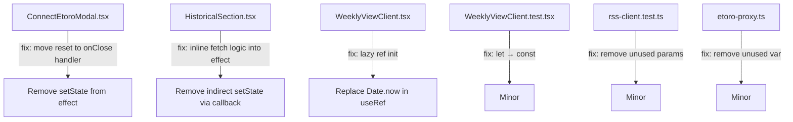

## Problem Statement

ESLint reports 4 errors (3 of which are React hooks violations in production components) that could cause cascading renders and unpredictable behavior:

1. **ConnectEtoroModal.tsx:23** — `react-hooks/set-state-in-effect`: Calling `setApiKey("")`, `setUserKey("")`, `setError("")`, `setIsSubmitting(false)` synchronously inside a `useEffect` when the modal closes. This triggers cascading renders.

2. **HistoricalSection.tsx:54** — `react-hooks/set-state-in-effect`: Calling `fetchMatches()` (which sets state) directly inside a `useEffect` body.

3. **WeeklyViewClient.tsx:138** — `react-hooks/purity`: Using `Date.now()` (an impure function) inside a `useRef` initializer during render, which violates React's idempotency rules.

4. **WeeklyViewClient.test.tsx:329** — `prefer-const`: Minor `let` that should be `const`.

Additionally, 7 warnings exist (unused variables in tests and etoro-proxy.ts).

## User Story

As a developer shipping to production, I want the codebase to have zero React hooks lint errors so that the app doesn't suffer from cascading renders or unpredictable behavior.

## How It Was Found

Running `npx eslint src/` during the surface-sweep review of iteration #17. All 4 errors reproduced consistently.

## Proposed Fix

1. **ConnectEtoroModal.tsx** — Move the form-reset logic out of the `useEffect`. Use a ref to track previous `showConnectModal` value and reset form state on the transition from `true` to `false` via an event handler or the `onClose` callback, not in the effect body.

2. **HistoricalSection.tsx** — Restructure the effect so `fetchMatches` is not called synchronously. Wrap the fetch call inside a proper async pattern or use an event-driven approach.

3. **WeeklyViewClient.tsx** — Replace the `Date.now()` call in the `useRef` initializer with a lazy initialization pattern (e.g., initialize to `0` and set the actual value in an effect, or use a module-level timestamp).

4. **WeeklyViewClient.test.tsx** — Change `let resolvers` to `const resolvers`.

5. Clean up the 7 warnings (unused variables) for a fully clean lint run.

## Acceptance Criteria

- [ ] `npx eslint src/` returns 0 errors
- [ ] `npx eslint src/` returns 0 warnings
- [ ] All 193 existing tests still pass
- [ ] `npx next build` succeeds without errors
- [ ] No behavioral regressions in the Connect eToro modal, historical section, or weekly view

## Verification

- Run `npx eslint src/` and verify clean output
- Run `npx vitest run` and verify all tests pass
- Run `npx next build` and verify clean build
- Open the app in agent-browser and verify the Connect eToro modal, historical section, and weekly view all function correctly

## Out of Scope

- Adding new lint rules
- Refactoring beyond what's needed to fix these specific errors
- Changing test framework or test patterns

---

## Planning

### Overview

Fix 4 ESLint errors and 7 warnings across 5 files. The errors involve React hooks rule violations that cause cascading renders and impure render behavior. All fixes are localized refactors with no cross-component dependencies.

### Research Notes

- `react-hooks/set-state-in-effect` (React 19 / eslint-plugin-react-hooks v5+): Synchronous `setState` inside `useEffect` bodies triggers an extra render cycle. The fix is to either move state resets to event handlers or use a different pattern.
- `react-hooks/purity`: `Date.now()` in a `useRef` initializer violates the idempotency rule because re-renders could theoretically produce different initial values (React expects render to be pure).
- The unused variable warnings in test files can be fixed by prefixing with `_` or removing them.

### Architecture Diagram

### One-Week Decision

**YES** — This is a few hours of work at most. All fixes are localized to specific lines in 5-6 files with no architectural changes needed.

### Implementation Plan

**Phase 1 — Fix ConnectEtoroModal.tsx (react-hooks/set-state-in-effect)**
- Remove the `setApiKey("")`, `setUserKey("")`, `setError("")`, `setIsSubmitting(false)` calls from the `useEffect`.
- The effect should only manage `dialog.showModal()` / `dialog.close()`.
- Move form reset to the `closeConnectModal` flow — either reset on the next `showConnectModal=true` transition (guard on open), or handle in `onClose` callback.

**Phase 2 — Fix HistoricalSection.tsx (react-hooks/set-state-in-effect)**
- The issue is that `fetchMatches()` is called synchronously in the effect which internally calls setState.
- Inline the fetch logic directly into the effect rather than calling through the `useCallback` wrapper. The `useCallback` (`fetchMatches`) is also used by a retry button, so keep it but don't call it from the effect. Instead, duplicate the fetch-and-setState logic in the effect with the cancelled flag pattern already in place.

**Phase 3 — Fix WeeklyViewClient.tsx (react-hooks/purity)**
- Replace `Date.now()` in the useRef initializer. Use `0` as initial value — the cache entry is only checked against `CACHE_TTL_MS`, and since the data is fresh on first render, using `0` or any timestamp is equivalent for the first render cycle.
- Alternative: use a module-level `const INITIAL_TIMESTAMP = Date.now()` outside the component.

**Phase 4 — Fix minor issues**
- `WeeklyViewClient.test.tsx:329`: Change `let resolvers` to `const resolvers`.
- `rss-client.test.ts:62,74`: Prefix unused params with `_` (already prefixed but still flagged — check if the pattern matches the config, or remove them entirely by destructuring).
- `etoro-proxy.ts:103`: Remove the unused `text` variable.

**Phase 5 — Verify**
- Run `npx eslint src/` — expect 0 errors, 0 warnings.
- Run `npx vitest run` — expect 193/193 tests pass.
- Run `npx next build` — expect clean build.
