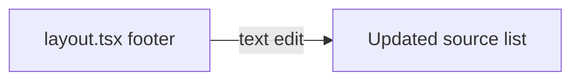

## Problem statement

The footer in `src/app/layout.tsx` states "News from Reuters, Bloomberg, Financial Times, and other major financial outlets." However, the app's actual RSS feed sources (defined in `src/lib/rss-client.ts`) are:

- Google News (multiple regions: US, UK, DE)
- Google News Business
- CNBC / CNBC World
- Yahoo Finance
- Reuters
- BBC World / BBC News / BBC Business
- Al Jazeera

Bloomberg and Financial Times are **not** direct feeds. While their articles may occasionally appear via Google News aggregation, claiming them as sources is misleading — especially for a financial trading tool where accuracy and trust are critical.

## User story

As a user of a trading tool, I want the source attribution in the footer to accurately reflect where the data comes from, so that I can trust the information and make informed decisions.

## How it was found

During a surface-sweep review of the production app, the footer text was compared against the actual feed configuration in `src/lib/rss-client.ts`. Bloomberg and Financial Times are not configured as direct RSS sources.

## Proposed UX

Update the footer sources text to accurately reflect the actual feeds. Example:

> News aggregated from Google News, CNBC, BBC, Yahoo Finance, Reuters, and other major financial outlets. Historical data from publicly available market records.

Keep it concise — list the 4-5 most recognizable actual sources and use "and other major financial outlets" as a catch-all.

## Acceptance criteria

- [ ] Footer sources text only mentions outlets that are actual configured RSS feeds
- [ ] Bloomberg and Financial Times are not listed unless they are added as direct feeds
- [ ] The text remains concise and professional
- [ ] All existing tests pass

## Verification

- Run `vitest run` — all tests pass
- Open http://localhost:3050 in browser, scroll to footer, confirm source list matches actual feeds
- Cross-reference with `STATIC_FEEDS` in `src/lib/rss-client.ts`

## Out of scope

- Adding Bloomberg or Financial Times as direct RSS feeds
- Changing the actual feed sources
- Modifying the methodology explanation text

## Overview

Single-file text change in the footer section of `src/app/layout.tsx`. Replace inaccurate source names with the actual configured RSS feed sources.

## Research notes

Actual feed sources from `STATIC_FEEDS` in `src/lib/rss-client.ts`:
- **Global**: Google News, Google News Business, Yahoo Finance, CNBC, CNBC World, Reuters, BBC World, Al Jazeera
- **Local**: Google News UK, Google News UK Business, BBC News, BBC Business, Google News DE
- **Dynamic**: Google News search feeds

Most recognizable for users: Reuters, CNBC, BBC, Yahoo Finance (Google News is an aggregator, not a brand outlet).

## Assumptions

None — straightforward text edit.

## Architecture diagram

## One-week decision

**YES** — This is a single line of text to change. Takes < 5 minutes.

## Implementation plan

1. Edit `src/app/layout.tsx` line 85: replace "Reuters, Bloomberg, Financial Times" with "Reuters, CNBC, BBC, Yahoo Finance"
2. Run tests to confirm nothing breaks
3. Verify in browser
