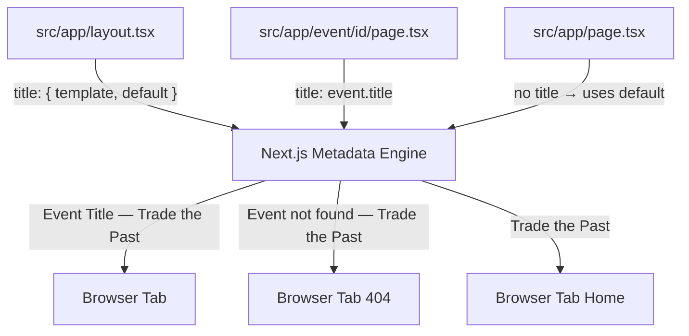

## Problem statement

The 404 event detail page shows "Event not found" as its browser tab title without the " — Trade the Past" brand suffix. All other pages include the suffix (e.g. "This Week — Trade the Past", "Purdue Pharma receives $5.5 billion sentence... — Trade the Past"). The root layout uses a plain `title: "Trade the Past"` string in its metadata instead of a Next.js title template, which means every page must manually append the suffix — and the not-found case was missed.

## User story

As a user who navigates to a non-existent event URL, I want to see "Trade the Past" branding in the browser tab even on error pages, so the experience feels consistent and professional.

## How it was found

During a browser review, navigating to `http://localhost:3050/event/nonexistent-event-id` showed the browser tab title as just "Event not found" without any branding. Confirmed in `src/app/event/[id]/page.tsx` line 35: `return { title: "Event not found" }` — no brand suffix. Meanwhile line 37 for valid events uses `title: \`\${event.title} — Trade the Past\`` manually.

## Proposed UX

All pages should show "Page Title — Trade the Past" in the browser tab, including 404 and error pages. Use Next.js metadata title template in the root layout so this is automatic:

```ts
export const metadata: Metadata = {
  title: { template: "%s — Trade the Past", default: "Trade the Past" },
  ...
};
```

Then simplify all page-level `generateMetadata` to return just the page-specific title without manually appending the suffix.

## Acceptance criteria

- [ ] Root layout metadata uses `title: { template: "%s — Trade the Past", default: "Trade the Past" }`
- [ ] Event detail page for valid events sets `title: event.title` (template handles suffix)
- [ ] Event detail page for invalid events sets `title: "Event not found"` (template handles suffix → "Event not found — Trade the Past")
- [ ] Home page title remains "Trade the Past" (uses `default`)
- [ ] `npm run build` succeeds
- [ ] All existing tests pass
- [ ] Verified in browser: 404 tab shows "Event not found — Trade the Past"

## Verification

Run all tests and verify in browser with agent-browser (take a screenshot as evidence).

## Out of scope

- Adding metadata to individual error boundary components
- Open Graph or social sharing meta tags
- Adding page descriptions to all pages

---

## Planning

### Overview

The root layout metadata uses a plain string `title: "Trade the Past"` instead of a Next.js metadata title template. This means each page must manually append " — Trade the Past" in its `generateMetadata`. The event detail 404 case was missed, resulting in "Event not found" as the tab title without branding.

### Research notes

- Next.js metadata supports `title: { template: "%s — Trade the Past", default: "Trade the Past" }` in the root layout.
- When a child page sets `title: "Page Title"`, Next.js automatically applies the template: `"Page Title — Trade the Past"`.
- The `default` value is used when the page doesn't set its own title (home page).
- This is the standard Next.js pattern for consistent branding. See: https://nextjs.org/docs/app/api-reference/functions/generate-metadata#title

### Assumptions

- The home page should keep showing "Trade the Past" (no suffix).
- The event detail page currently manually appends " — Trade the Past" which will become redundant.

### Architecture diagram



### One-week decision

**YES** — This is a 2-file change taking under 30 minutes. Trivially within one week.

### Implementation plan

1. Update `src/app/layout.tsx` metadata to use title template: `{ template: "%s — Trade the Past", default: "Trade the Past" }`
2. Simplify `src/app/event/[id]/page.tsx` `generateMetadata`:
   - Valid event: `return { title: event.title }` (removes manual " — Trade the Past")
   - Not found: `return { title: "Event not found" }` (template adds branding automatically)
3. Check if any other pages have `generateMetadata` that manually appends the suffix — simplify those too.
4. Run `npm run build` and `npm test`.
5. Verify in browser: 404 page tab shows "Event not found — Trade the Past".
