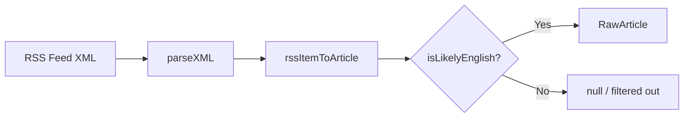

## Problem statement

The RSS news pipeline has no language filter. Although Google News feeds use `hl=en` parameters, non-English articles can still slip through — especially from feeds like Al Jazeera, or when Google News surfaces trending foreign-language content. When this happens, event titles appear in Arabic, Chinese, or other scripts, making the app look broken and unprofessional.

The product owner flagged this as CRITICAL in the backlog: "The news feed is showing articles in Arabic, Chinese, and other languages mixed with English content. Example: 'المتداول العربي' and '富途牛牛' appear in event titles. This looks broken and unprofessional."

## User story

As a trader using Trade the Past, I want to only see English-language events so that the app looks professional and all content is readable.

## How it was found

Product owner backlog feedback (CRITICAL priority). The RSS pipeline in `src/lib/rss-client.ts` function `rssItemToArticle` has no language detection — it accepts any article with a title longer than 15 characters regardless of script.

## Proposed UX

No visual change — non-English articles are silently dropped during RSS ingestion. Users only see English-language events. The filter should be invisible to the user.

## Acceptance criteria

- [ ] `rssItemToArticle` rejects articles whose title contains characters from non-Latin scripts (Arabic, CJK, Hangul, Cyrillic, Devanagari, Thai, etc.)
- [ ] The filter uses a lightweight regex or character code check — no external NLP library needed
- [ ] A unit test verifies that English titles pass and non-English titles (Arabic, Chinese, mixed) are filtered
- [ ] A unit test verifies that English titles with smart quotes, em-dashes, and accented names (e.g., "Macron's", "Zürich") still pass
- [ ] Existing tests continue to pass
- [ ] The filter runs in `rssItemToArticle` before the article is returned

## Verification

- Run `npm test` — all tests pass including new language filter tests
- Check the running app — only English events appear in both global and local scopes

## Out of scope

- NLP-based language detection (overkill — character script check is sufficient)
- User language preferences (separate future feature per backlog)
- Translating non-English content

---

## Planning

### Overview

Add a lightweight language filter to `rssItemToArticle` in `src/lib/rss-client.ts` that drops articles with non-Latin script characters in the title. The filter uses Unicode regex character property escapes (`\p{Script=...}`) to detect Arabic, CJK Unified, Hangul, Cyrillic, Devanagari, and Thai scripts.

### Research notes

- JavaScript supports Unicode property escapes in regex with the `/u` flag: `\p{Script=Arabic}`, `\p{Script=Han}`, `\p{Script=Hangul}`, `\p{Script=Cyrillic}`, `\p{Script=Devanagari}`, `\p{Script=Thai}`
- Smart quotes (U+2018-U+201D), em-dashes (U+2014), and accented Latin characters (é, ü, ñ) are NOT in these script categories, so they pass through correctly
- Google News `hl=en` mostly returns English, but Al Jazeera and other feeds can return mixed-language content
- No external library needed — native JS regex with Unicode property escapes is sufficient

### Architecture diagram

### One-week decision

**YES** — This is a ~30-minute task. One function, one regex, a few unit tests.

### Implementation plan

1. Add `isLikelyEnglish(text: string): boolean` function to `src/lib/rss-client.ts`
   - Uses regex with Unicode property escapes to check for non-Latin scripts
   - Returns false if title contains 2+ characters from Arabic, CJK, Hangul, Cyrillic, Devanagari, or Thai scripts
   - Threshold of 2+ avoids false positives from stray Unicode characters
2. Call `isLikelyEnglish(title)` in `rssItemToArticle` after source suffix stripping, before returning the article. Return `null` if not English.
3. Export `isLikelyEnglish` for testing.
4. Add unit tests in `src/lib/__tests__/rss-language-filter.test.ts`:
   - English titles pass (including smart quotes, em-dashes, accented chars)
   - Arabic titles fail
   - Chinese titles fail
   - Mixed English+Arabic fails
   - Cyrillic titles fail
5. Run full test suite to verify no regressions.
