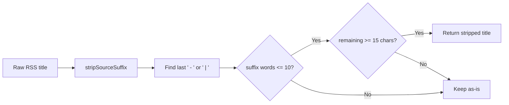

## Problem statement

`stripSourceSuffix` in `src/lib/rss-client.ts` rejects suffixes with more than 5 words (`suffix.split(/\s+/).length > 5`). Institutional source names like "The Chartered Institute of Export & International Trade" (8 words) exceed this limit and remain in the title. This was observed live in the local scope (Thursday card) showing the full title:

"The Day in Trade: Industry questions alleged UK-EU SPS agreement benefits, Russia war economy falters and shipping through Strait of Hormuz in limbo - The Chartered Institute of Export & International Trade"

The product owner's backlog specifically called out source suffix cleanup as CRITICAL.

## User story

As a trader viewing event cards, I want titles free of long institutional source names so that the feed looks clean and professional.

## How it was found

Surface sweep of the local scope weekly view. The Thursday card displayed a title ending with "- The Chartered Institute of Export & International Trade" — a source name that was not stripped because it exceeds the 5-word limit.

## Proposed UX

No visual change — the suffix is silently stripped during RSS ingestion, producing a cleaner title on the event card.

## Acceptance criteria

- [ ] `stripSourceSuffix` strips suffixes up to 10 words (increased from 5)
- [ ] The title "X - The Chartered Institute of Export & International Trade" is stripped to "X"
- [ ] Short suffixes (1-5 words) still stripped correctly
- [ ] Suffixes over 10 words are still preserved (safety limit)
- [ ] The minimum remaining title length (15 chars) check is still enforced
- [ ] Existing tests continue to pass
- [ ] New test covers the 8-word institutional source name case

## Verification

- Run `npm test` — all tests pass including updated source suffix tests
- Check the local scope in the running app — no trailing institutional source names visible

## Out of scope

- Source prefix stripping (e.g. "investingLive" — separate pattern, not a suffix)
- NLP-based source detection

---

## Planning

### Overview

Increase the word limit in `stripSourceSuffix` from 5 to 10 so that long institutional source names like "The Chartered Institute of Export & International Trade" (8 words) are correctly stripped. Update the existing test that checks the 5-word boundary to use the new 10-word boundary, and add a new test for the 8-word institutional source name.

### Research notes

- `stripSourceSuffix` in `src/lib/rss-client.ts` line 229 has: `if (suffix.split(/\s+/).length > 5) break;`
- Real-world long source names: "The Chartered Institute of Export & International Trade" (8 words), "The International Institute for Strategic Studies" (6 words)
- The longest reasonable publication name is ~8-9 words. Setting limit to 10 provides a safe buffer.
- Existing test at line 148-151 asserts that a 10-word suffix is preserved — this test needs updating to use a suffix > 10 words.
- The pipe-separator test at line 167-169 uses the same 10-word suffix — also needs updating.

### Assumptions

- Source names longer than 10 words are extremely rare; 10-word limit is safe
- The minimum remaining title length (15 chars) check provides additional safety

### Architecture diagram

### One-week decision

**YES** — This is a 5-minute change: one constant from 5 to 10, and update 3 tests.

### Implementation plan

1. In `src/lib/rss-client.ts` line 229, change `suffix.split(/\s+/).length > 5` to `suffix.split(/\s+/).length > 10`
2. In `src/lib/__tests__/rss-client.test.ts`:
   - Update test "does not strip long suffixes that look like content (more than 5 words)" to use a suffix > 10 words and rename it
   - Update test "does not strip pipe-separated long suffixes that look like content" similarly
   - Add new test: "strips long institutional source names like 'The Chartered Institute of Export & International Trade'"
3. Run full test suite to verify no regressions
