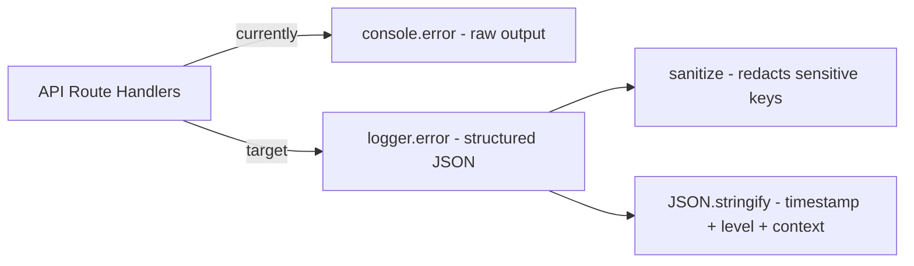

## Problem Statement

Three API route handlers use raw `console.error` instead of the app's structured logger (`@/lib/logger`):

1. `src/app/api/auth/etoro/route.ts` (line 54) — handles authentication credentials
2. `src/app/api/events/route.ts` (line 25)
3. `src/app/api/events/[id]/route.ts` (line 32)

Meanwhile, the eToro trade, watchlist, and search routes already use `logger.error` with structured context (route, symbol, timeout). The 3 remaining routes bypass the logger's JSON formatting, timestamp injection, and — critically — the `sanitize()` function that redacts sensitive keys (passwords, tokens, API keys).

This is especially risky in the auth route, where a non-Error exception object could contain credential data that gets dumped raw to stdout.

## User Story

As a developer operating this app in production, I want all API error logs to go through the structured logger so that I can search, filter, and monitor errors consistently without risking sensitive data leaks in log output.

## How It Was Found

Surface sweep — grep for `console.error` in API routes found 3 instances that don't use the structured logger, while the eToro proxy routes correctly use `logger.error`.

## Proposed Fix

Replace `console.error(...)` with `logger.error(...)` in each of the 3 routes, providing structured context (route path, error type) consistent with how the eToro routes log errors.

## Acceptance Criteria

- [ ] `src/app/api/auth/etoro/route.ts` uses `logger.error` instead of `console.error`
- [ ] `src/app/api/events/route.ts` uses `logger.error` instead of `console.error`
- [ ] `src/app/api/events/[id]/route.ts` uses `logger.error` instead of `console.error`
- [ ] No remaining `console.error` calls in any `src/app/api/` route files (excluding test files)
- [ ] All existing tests pass
- [ ] Build succeeds

## Verification

- `grep -r "console.error" src/app/api/` returns no matches (only test files if any)
- `npm test` passes
- `npm run build` succeeds

## Out of Scope

- Changing the logger implementation itself
- Adding new log levels or log destinations
- Modifying `console.warn` in `src/lib/env.ts` (startup warnings, not API error paths)

---

## Planning

### Overview

Replace 3 instances of raw `console.error` in API route handlers with the structured `logger.error` from `@/lib/logger`. The logger provides JSON-formatted output with timestamps, and its `sanitize()` function redacts sensitive keys — important for the auth route that handles credential errors.

### Research Notes

- The app already has a structured logger at `src/lib/logger.ts` that outputs JSON with `{ timestamp, level, message, context }`.
- The logger's `sanitize()` function redacts keys matching `/key|secret|token|password|authorization|cookie/i`.
- The eToro proxy routes (`trade`, `watchlist`, `search`) already use `logger.error` correctly with structured context like `{ route, symbol, timeout }`.
- The 3 target routes use `console.error("prefix:", error instanceof Error ? error.message : error)` — they do extract `.message` but still bypass sanitization for non-Error exceptions.

### Assumptions

- No changes needed to the logger implementation itself.
- The existing test suite covers these error paths adequately (or doesn't mock console.error in a way that would break).

### Architecture Diagram

### One-Week Decision

**YES** — This is a ~15-minute task. Three single-line replacements with import additions.

### Implementation Plan

1. In each of the 3 files, add `import { logger } from "@/lib/logger"` (or use dynamic import pattern if consistent with existing code).
2. Replace `console.error("...", ...)` with `logger.error("...", { route: "...", error: "..." })` providing structured context.
3. Verify: `npm test` and `npm run build` pass.
4. Verify: no `console.error` in `src/app/api/` route files.
