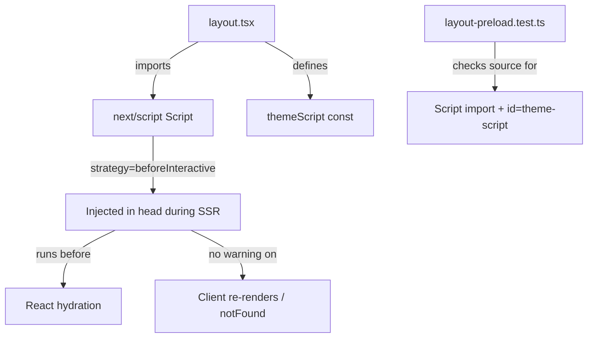

## Problem Statement

The anti-FOUC theme script in `src/app/layout.tsx` line 39 uses `<script dangerouslySetInnerHTML={{ __html: themeScript }} />` inside the `<head>`. On pages rendered via `notFound()` (e.g. `/event/nonexistent-id`), React 19 emits a console error:

> "Encountered a script tag while rendering React component. Scripts inside React components are never executed when rendering on the client. Consider using template tag instead."

This shows as a red "1 Issue" badge in the Next.js dev overlay on not-found event pages. While the theme script executes correctly during SSR (preventing flash), the console error is noise that masks real issues and indicates a deprecated pattern.

## User Story

As a developer, I want zero console errors on all pages so that real issues are immediately visible and not lost in noise.

## How It Was Found

During browser testing with agent-browser: navigated to `/event/nonexistent-xyz`, observed the Next.js dev overlay showing "1 Issue" with a red badge. Clicking the badge revealed the console error pointing to `layout.tsx` line 39.

Screenshot evidence: `review-screenshots/172-nextjs-issue.png`

The error does NOT appear on normal pages (home, event detail) or the generic 404 (`/does-not-exist-at-all`). It specifically triggers on pages that call `notFound()` from a server component.

## Proposed UX

No visible UX change — the theme script must still prevent FOUC (flash of unstyled content). The fix is in the implementation approach:

Replace `<script dangerouslySetInnerHTML>` with `next/script` using `strategy="beforeInteractive"`, which is the Next.js-recommended pattern for critical inline scripts that must run before hydration.

## Acceptance Criteria

- [ ] The theme script still prevents FOUC (dark mode flash) on initial page load
- [ ] No console errors on `/event/nonexistent-id` or any other not-found page
- [ ] No console errors on normal pages (home, event detail)
- [ ] Dark mode toggle still works correctly
- [ ] All existing tests pass

## Verification

- Run `npm test` — all tests pass
- Navigate to `/event/nonexistent-xyz` in browser — no "1 Issue" badge in dev overlay
- Toggle dark mode — theme persists across navigation
- Hard refresh on dark mode page — no FOUC

## Out of Scope

- Changing the theme detection logic itself
- Adding new theme options
- Modifying the ThemeProvider component

---

## Planning

### Overview

Replace the raw `<script dangerouslySetInnerHTML>` anti-FOUC pattern in `layout.tsx` with the `next/script` `Script` component using `strategy="beforeInteractive"`. This is the Next.js-canonical approach for critical inline scripts that must execute before hydration, and avoids the React 19 console warning about script tags in React components.

### Research Notes

- **React 19 behavior**: React 19 treats `<script>` tags in JSX differently from other elements. When rendering on the client (e.g. during `notFound()` soft navigation), React warns that scripts in components are never executed on the client side. The SSR initial render still works, but re-renders trigger the warning.
- **Next.js `Script` component**: `next/script` with `strategy="beforeInteractive"` injects the script into `<head>` during SSR and handles it correctly across navigations without triggering React warnings. It must be used in a layout file (not a page) when using `beforeInteractive`.
- **Test impact**: `src/app/__tests__/layout-preload.test.ts` line 23 checks for `dangerouslySetInnerHTML` in the layout source text. This must be updated to reflect the new pattern.

### Assumptions

- The `next/script` component with `strategy="beforeInteractive"` supports `dangerouslySetInnerHTML` for inline scripts (documented in Next.js docs).
- No other components reference the theme script pattern.

### Architecture Diagram

### One-Week Decision

**YES** — This is a ~30-minute change affecting 2 files: `layout.tsx` (swap script tag for Script component) and `layout-preload.test.ts` (update assertion).

### Implementation Plan

1. In `src/app/layout.tsx`:
   - Add `import Script from "next/script"` 
   - Replace `<script dangerouslySetInnerHTML={{ __html: themeScript }} />` with `<Script id="theme-script" strategy="beforeInteractive" dangerouslySetInnerHTML={{ __html: themeScript }} />`
2. In `src/app/__tests__/layout-preload.test.ts`:
   - Update the test that checks for `dangerouslySetInnerHTML` ordering — change it to check for the Script component pattern (e.g. check for `id="theme-script"` or `next/script` import)
3. Run `npm test` to verify all tests pass
4. Verify in browser: navigate to `/event/nonexistent-id` — no "1 Issue" badge
5. Verify dark mode toggle and FOUC prevention still work
