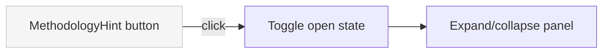

## Problem statement

The "How does this work?" button on the weekly view uses `text-muted/50` — a muted color at 50% opacity — making it nearly invisible against the background. In a fresh-eyes test, it's the least visible element on the page despite being the primary onboarding mechanism for first-time users.

## User story

As a first-time visitor, I want to quickly understand what this app does and how it works, so that I can decide whether to engage with the event cards and trading features.

## How it was found

Fresh-eyes browser review (iteration #32). Opened the landing page as a new user. The "How does this work?" button at `text-[11px] text-muted/50` was barely distinguishable from the background. Had to look carefully to notice it existed. Screenshot evidence: `review-screenshots/176-landing-first-impression.png`.

## Proposed UX

- Change the button from `text-muted/50` to a more visible style — use `text-muted` (full opacity) with a subtle underline or a small "?" icon prefix.
- Increase font size from `11px` to `13px`.
- Keep the toggle behavior (expand/collapse) but make the collapsed state clearly visible as a clickable element.

## Acceptance criteria

- [ ] "How does this work?" button is visible at a glance without straining (not opacity-reduced)
- [ ] Font size is at least 13px
- [ ] Button still toggles the methodology explanation open/closed
- [ ] Visual treatment matches eToro design system (no hardcoded hex values)
- [ ] Existing MethodologyHint tests still pass

## Verification

- Run all tests: `npm test`
- Open http://localhost:3050 in agent-browser and verify the link is clearly visible
- Take a screenshot as evidence

## Out of scope

- Rewriting the methodology text content
- Adding a full onboarding walkthrough or tour
- Changing the expanded state styling

---

## Planning

### Research notes

- The `MethodologyHint` component is inside `src/components/WeeklyViewClient.tsx` (lines 65-88).
- Current style: `text-[11px] text-muted/50 hover:text-muted/70` — extremely low contrast.
- The button toggles an expandable panel with methodology description.
- No separate tests for `MethodologyHint` — it's part of `WeeklyViewClient` tests.

### Architecture diagram

### One-week decision

**YES** — This is a 2-line CSS class change in one component. Under 30 minutes of work.

### Implementation plan

1. In `WeeklyViewClient.tsx`, update the `MethodologyHint` button classes:
   - Change `text-[11px]` to `text-[13px]`
   - Change `text-muted/50 hover:text-muted/70` to `text-muted hover:text-foreground`
   - Add `underline decoration-dotted underline-offset-2` for discoverability
2. Run tests to verify nothing breaks
3. Verify visually in browser
