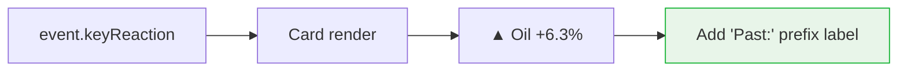

## Problem statement

Event cards on the weekly view show a key market reaction preview like "▲ Oil +6.3%" but there is no label indicating this is a HISTORICAL reaction from similar past events. A first-time user would naturally assume this is today's actual price movement, which could mislead them into making trading decisions based on a misunderstanding.

## User story

As a first-time trader visiting the app, I want to clearly understand that the percentage shown on event cards is a historical reaction from similar past events, so that I don't confuse it with today's live market data.

## How it was found

Fresh-eyes browser review (iteration #32). Looked at the event cards as a brand-new user and initially interpreted "▲ Oil +6.3%" as today's price change. Only after clicking into the event detail and reading the historical context did it become clear this was past data. Screenshot evidence: `review-screenshots/176-landing-first-impression.png`.

## Proposed UX

Add a small contextual label above or inline with the reaction preview. For example:
- "Past:" prefix in muted text before the arrow/percentage, e.g. "Past: ▲ Oil +6.3%"
- Or a tiny label "Historical reaction" above the value at 10px muted

Keep the visual weight light — this should clarify, not clutter.

## Acceptance criteria

- [ ] Key reaction preview on event cards includes a visible label indicating it's historical data (e.g. "Past:" prefix or "Historical" label)
- [ ] Label uses design system tokens (no hardcoded colors)
- [ ] Label is legible but doesn't compete with the main event title for visual hierarchy
- [ ] Existing WeeklyViewClient tests still pass

## Verification

- Run all tests: `npm test`
- Open http://localhost:3050 in agent-browser and verify the label is present on event cards
- Take a screenshot as evidence

## Out of scope

- Changing the event detail page historical section
- Adding live price data
- Modifying the market reaction table

---

## Planning

### Research notes

- The key reaction preview is rendered in `WeeklyViewClient.tsx` lines 355-370, inside the event card link component.
- It shows `event.keyReaction` data with an arrow, asset name, and percentage.
- The `keyReaction` comes from historical matches (populated in task `trade-the-past-populate-key-reaction-weekly-cards`).
- No label currently distinguishes this from live market data.

### Architecture diagram

### One-week decision

**YES** — This is adding a small text prefix to an existing span. Under 15 minutes of work.

### Implementation plan

1. In `WeeklyViewClient.tsx`, inside the `keyReaction` rendering block (~line 357), add a muted "Past:" prefix before the arrow/asset/percentage span.
2. Style the prefix as `text-[10px] text-muted font-medium` to keep it visually lightweight.
3. Run tests to verify nothing breaks.
4. Verify visually in browser.
