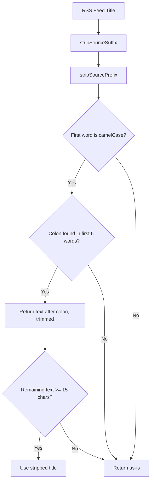

## Problem statement

In the local scope (UK / DE / FR), the Tuesday April 28 event title displays as:

> **investingLive Americas FX news wrap: Dovish BoJ's Ueda, ECB inflation expectations surge**

The "investingLive" prefix is a source-branding artifact from Investing.com's RSS feed that was not stripped by the existing `stripSourceSuffix` function. The current function only strips **suffixes** (trailing text after ` - ` or ` | `), but some news sources prepend their brand name as a **prefix** using a colon separator.

This makes the app look unprofessional — a camelCase string at the start of a headline looks like a code artifact leaking into the UI.

## User story

As a trader reading the weekly event list, I want event titles to show clean headlines without source branding prefixes, so the app looks polished and professional.

## How it was found

During a surface-sweep browser review of the local scope view at `http://localhost:3050`. The event card for Tuesday April 28 showed "investingLive Americas FX news wrap: ..." as the headline. Verified in both the weekly card and the event detail page. Also confirmed in the API response from `/api/events?scope=local`.

## Proposed UX

The title should display as:

> **Dovish BoJ's Ueda, ECB inflation expectations surge**

The "investingLive Americas FX news wrap:" prefix should be stripped during RSS processing.

## Implementation approach

Extend `stripSourceSuffix` (or add a companion `stripSourcePrefix`) in `src/lib/rss-client.ts` to detect and remove known patterns of source branding prefixes:

1. Detect camelCase-prefixed titles where the prefix word has no spaces and is followed by a sentence (e.g., `investingLive Americas...`). A camelCase word at position 0 followed by a title-case or uppercase word is very likely a source brand prefix.
2. Alternatively, detect the pattern `<BrandPrefix> <ColumnName>: <actual headline>` and strip everything before the colon when the prefix portion looks like a branded column name (short, under ~6 words before colon).
3. Ensure the stripping only applies to Google News feed titles (same guard as existing suffix stripping).

## Acceptance criteria

- [ ] Event title "investingLive Americas FX news wrap: Dovish BoJ's Ueda, ECB inflation expectations surge" is stripped to "Dovish BoJ's Ueda, ECB inflation expectations surge"
- [ ] Stripping only applies to Google News feed sources
- [ ] Regular titles with colons (e.g., "Fed Chair: We will hold rates steady") are NOT affected
- [ ] Existing `stripSourceSuffix` tests continue to pass
- [ ] New unit tests cover the prefix stripping logic
- [ ] Local scope view shows clean titles in the browser

## Verification

- Run `npm test` — all tests pass
- Browse local scope in agent-browser and verify no source prefixes visible
- Verify global scope titles are unaffected

## Out of scope

- Rewriting the entire source stripping architecture
- Handling non-English source prefixes
- Stripping source names that are actual parts of the headline

---

## Planning

### Overview

Add a `stripSourcePrefix` function to `src/lib/rss-client.ts` that removes branded column-name prefixes from Google News RSS titles. The key pattern is: a short prefix (under ~6 words) ending with a colon, where the prefix contains a camelCase word (strong signal it's a brand name rather than editorial content).

### Research notes

- The problematic title: `investingLive Americas FX news wrap: Dovish BoJ's Ueda, ECB inflation expectations surge`
- The prefix `investingLive Americas FX news wrap:` is a branded column from Investing.com
- The distinguishing feature: `investingLive` is camelCase — real headlines almost never start with camelCase words
- Existing `stripSourceSuffix` handles the trailing source name after ` - ` or ` | ` but not leading prefixes
- Must NOT strip legitimate colons in headlines like `Fed Chair: We will hold rates steady` — the key difference is that editorial colons follow a person/entity name, not a camelCase brand word
- Safest heuristic: strip a `prefix:` only when the first word of the title is camelCase (has both lower and upper chars in non-first position)

### Assumptions

- camelCase detection is sufficient to distinguish brand prefixes from editorial colons
- This function will be called AFTER `stripSourceSuffix` in `rssItemToArticle`, same guard (`feedSource.startsWith("Google News")`)

### Architecture diagram

### One-week decision

**YES** — This is a small, focused change: one new function (~15 lines), one call site in `rssItemToArticle`, and ~8 test cases. Well under one day of work.

### Implementation plan

1. Add `stripSourcePrefix(title: string): string` in `src/lib/rss-client.ts`
   - Check if the first word matches `/^[a-z]+[A-Z][a-zA-Z]*$/` (camelCase)
   - Find the first colon within the first 6 words
   - If both conditions met and remaining text >= 15 chars, strip the prefix
2. Call `stripSourcePrefix` in `rssItemToArticle` after `stripSourceSuffix`, inside the `feedSource.startsWith("Google News")` guard
3. Export the function for testing
4. Add test cases in `src/lib/__tests__/rss-client.test.ts`:
   - Strips camelCase prefix (`investingLive Americas FX news wrap: ...`)
   - Does NOT strip editorial colons (`Fed Chair: We will hold rates steady`)
   - Does NOT strip when first word is not camelCase (`Breaking News: ...`)
   - Does NOT strip when remaining text would be too short
   - Returns empty/null-ish input unchanged
   - Does NOT strip when colon is beyond 6th word
