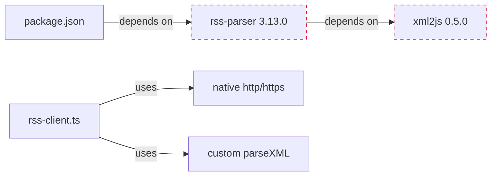

## Problem Statement

The `rss-parser` package (v3.13.0) is listed as a production dependency in `package.json` but is never imported anywhere in the codebase. The project replaced it with a custom lightweight XML parser in `src/lib/rss-client.ts` that uses native Node.js `http`/`https` and regex-based XML parsing. The dead dependency adds ~2MB to `node_modules` (including its transitive dependency `xml2js`) without being used.

## User Story

As a deployer, I want the production dependency list to contain only packages the application actually uses, so that install times are faster, deployment archives are smaller, and the supply chain attack surface is minimized.

## How It Was Found

During a performance review:
1. Searched for `rss-parser` imports across all `.ts` files — zero results
2. Confirmed `rss-client.ts` uses its own `parseXML()` function with native `http`/`https` modules
3. Verified `rss-parser` is NOT in the production build output (`.next/server/chunks/`) — Turbopack correctly tree-shakes it, but it still bloats `node_modules` and install
4. `npm ls rss-parser` shows it is a direct dependency with `xml2js` as a transitive dep

## Proposed Fix

1. Run `npm uninstall rss-parser` to remove the package and its transitive dependencies
2. Verify no import references exist anywhere in the codebase
3. Run full test suite to confirm nothing breaks
4. Run production build to confirm no build errors

## Acceptance Criteria

- [ ] `rss-parser` is removed from `package.json` dependencies
- [ ] `npm ls rss-parser` returns empty/error
- [ ] `node_modules/rss-parser/` does not exist after `npm install`
- [ ] All 235 tests pass
- [ ] Production build succeeds
- [ ] RSS feed fetching still works (no functional change)

## Verification

- `npm test` — all tests pass
- `npm run build` — build succeeds
- Manually verify `package.json` no longer lists `rss-parser`

## Out of Scope

- Rewriting the custom XML parser in rss-client.ts
- Adding a new RSS parsing library
- Changing the RSS feed fetching logic

## Planning

### Overview

Remove the `rss-parser` npm package from `package.json`. It was the original RSS parsing library used in the project, but the code was rewritten to use a custom lightweight XML parser in `rss-client.ts` with native Node.js `http`/`https` modules. The dependency is now dead — never imported anywhere.

### Research Notes

- Grep for `rss-parser` across all `.ts` files: zero imports
- `rss-client.ts` uses its own `parseXML()` function (regex-based XML extraction)
- `rss-parser` brings `xml2js` as a transitive dep — neither is used
- Total disk footprint: ~2MB in `node_modules`
- Not present in production build output (Turbopack tree-shakes it)
- No other package depends on `rss-parser` or `xml2js`

### Architecture Diagram

### One-Week Decision

**YES** — This is a single `npm uninstall` command followed by test/build verification. Estimated time: 10 minutes.

### Implementation Plan

1. Run `npm uninstall rss-parser`
2. Verify `package.json` no longer lists it
3. Run full test suite (`npm test`)
4. Run production build (`npm run build`)
5. Commit
