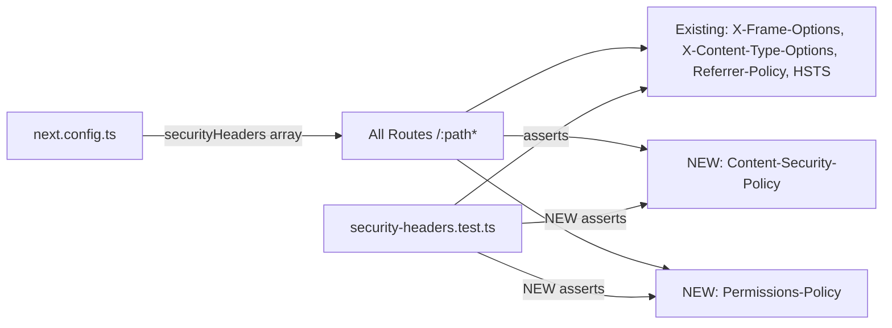

## Problem Statement

The app sets four security headers (X-Frame-Options, X-Content-Type-Options, Referrer-Policy, Strict-Transport-Security) in `next.config.ts` but is missing a `Content-Security-Policy` (CSP) header. CSP is the single most effective HTTP header for preventing XSS attacks — without it, an injected script tag or inline event handler would execute with no restriction. This is a gap in the "Production Hardening" section of the initiative spec, which requires ensuring no secrets leak and no code-injection vectors exist client-side.

## User Story

As a user who has connected their eToro API keys, I want the app to block unauthorized scripts from executing in my browser, so that my credentials and session are protected from XSS attacks.

## How It Was Found

During a surface-sweep review, inspecting the HTTP response headers via `curl -sI http://localhost:3050/` showed X-Frame-Options, X-Content-Type-Options, Referrer-Policy, and Strict-Transport-Security — but no Content-Security-Policy header. Confirmed by searching the codebase (`next.config.ts` securityHeaders array has no CSP entry).

## Research Notes

- Next.js supports CSP via the `headers()` function in `next.config.ts` — same place existing security headers are defined
- Next.js 16 with Turbopack uses inline scripts for hydration, requiring `'unsafe-inline'` in `script-src` (nonce-based CSP requires middleware, out of scope)
- The app loads one external font from `marketing.etorostatic.com` — must be allowed in `font-src`
- All eToro API calls go through backend proxy routes (`/api/etoro/*`) — `connect-src 'self'` is sufficient
- `frame-ancestors 'none'` is the CSP equivalent of `X-Frame-Options: DENY`
- `Permissions-Policy` replaces deprecated `Feature-Policy` header

## Architecture Diagram



## One-Week Decision

**YES** — This is a 2-file change (next.config.ts + test file). Adding entries to an existing array and extending tests.

## Implementation Plan

### Phase 1: Add CSP header to next.config.ts

Add to the `securityHeaders` array:
```
Content-Security-Policy: default-src 'self'; script-src 'self' 'unsafe-inline' 'unsafe-eval'; style-src 'self' 'unsafe-inline'; font-src 'self' https://marketing.etorostatic.com; img-src 'self' data: https:; connect-src 'self'; frame-ancestors 'none'
```

Add Permissions-Policy:
```
Permissions-Policy: camera=(), microphone=(), geolocation=()
```

### Phase 2: Update tests

Extend `security-headers.test.ts` to assert:
- CSP header is present and contains `default-src 'self'`
- CSP header contains `font-src` with the eToro font domain
- CSP header contains `frame-ancestors 'none'`
- Permissions-Policy header is present

### Phase 3: Verify

- Run full test suite
- Run build
- Verify headers via curl

## Acceptance Criteria

- [ ] Response headers include a `Content-Security-Policy` header on all routes
- [ ] Response headers include a `Permissions-Policy` header disabling camera, microphone, geolocation
- [ ] The app loads and renders correctly with the new CSP (landing page, event detail, dark mode, modals)
- [ ] eToro font loads correctly from the CDN
- [ ] No CSP violations in the browser console
- [ ] Existing security headers test updated to cover CSP and Permissions-Policy
- [ ] Build succeeds with no errors

## Out of Scope

- CSP nonce-based script allowlisting (requires per-request header generation, follow-up)
- Report-only mode or CSP violation reporting endpoint
- Subresource Integrity (SRI) for external resources
