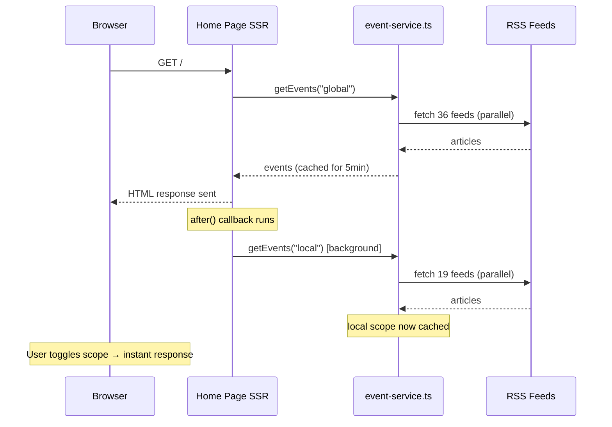

## Problem statement

When the home page loads, only the active scope's events are fetched and cached server-side (5-minute TTL in `eventsCache`). When a user toggles to the alternate scope (e.g., Global → Local), the first request hits a cold server cache and must fetch 19+ RSS feeds from external sources, taking ~1.9 seconds. This creates a noticeable delay on the first scope toggle after each cache expiry.

## User story

As a trader browsing global events, I want the local scope data to be already cached when I toggle, so that switching between Global and Local scope is instant every time — not just after the first toggle.

## How it was found

During performance review, the scope toggle from Global → Local was measured at 1901ms via browser Performance API. The `/api/events?scope=local` endpoint took ~1.9s to respond on a cold server cache while the cached response was <20ms. The bottleneck is the RSS feed fetching (19 feeds for local scope, each with up to 8s timeout).

## Proposed UX

No visible UI change. The scope toggle should respond in <200ms at all times (matching the already-cached case), not just after the first toggle.

## Research notes

- Next.js 15+ provides `after()` from `next/server` — runs a callback after the response is sent to the client without delaying the response. Available in Next.js 16.2.3 (this project).
- The `eventsCache` in `event-service.ts` is a module-level `Map` with 5-minute TTL. Warming it for both scopes means the `/api/events?scope=local` request will hit cached data.
- The home page (`src/app/(home)/page.tsx`) is the primary entry point where scope warm-up should happen.
- `getEvents()` is async and already handles errors gracefully (falls back to mock data), so background calls won't crash.

## Architecture diagram

## One-week decision

**YES** — This is a small, focused change: import `after()` from `next/server`, call `getEvents()` for the alternate scope in the `after()` callback on the home page. ~30 minutes of work.

## Implementation plan

### Phase 1: Add background prefetch to home page

1. In `src/app/(home)/page.tsx`:
   - Import `after` from `next/server`
   - Import `getEvents` directly (it's already used via dynamic import)
   - After the `fetchEvents()` call, use `after()` to call `getEvents("local")` (since home page defaults to global)
   - If the page loads with `?scope=local`, prefetch "global" instead

2. The `after()` call should be fire-and-forget — no awaiting, no error handling beyond what `getEvents` already does internally.

### Phase 2: Handle scope parameter

The home page doesn't currently read the `scope` search param (the client-side `WeeklyViewClient` handles it). The server always fetches "global". So the `after()` call always warms "local".

If we want to be thorough, we could also warm the alternate scope in the `/api/events` route handler. But the home page SSR path is sufficient since it's the primary entry point.

### Phase 3: Verify

- Run tests
- Start dev server, do a hard refresh
- Immediately toggle scope and measure response time — should be <500ms

## Acceptance criteria

- [ ] When the home page loads, the server-side events cache for the alternate scope is warmed in the background via `after()`
- [ ] The background prefetch does NOT delay the initial page response (verified by checking TTFB remains ~90ms)
- [ ] Scope toggle responds in <500ms even on a cold cache
- [ ] All existing tests pass
- [ ] No regression in page load time

## Out of scope

- Changing the cache TTL
- Adding client-side prefetch (already done in a prior task)
- Changing RSS feed fetching strategy
