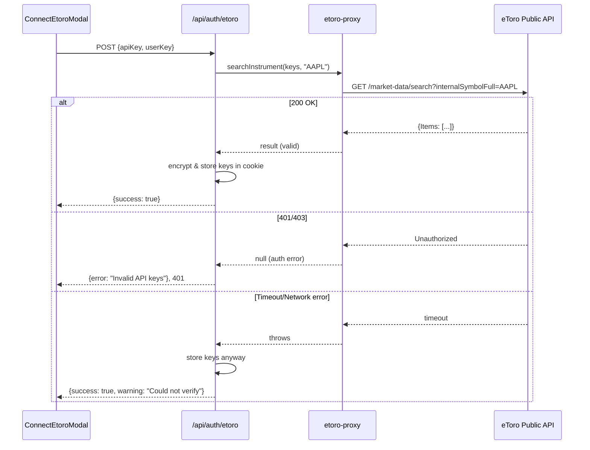

## Problem statement

The Connect eToro modal stores any API key and user key without verifying them against the eToro API. When a user enters garbage keys ("invalid-api-key" / "invalid-user-key"), the app shows "Connected to eToro" (Disconnect button in header) even though the keys are completely invalid. The user only discovers the keys are bad when they try to trade or add to watchlist, at which point they get confusing "Instrument not found" errors rather than "invalid credentials" errors.

## User story

As a trader connecting my eToro account, I want to know immediately if my API keys are wrong so that I don't spend time trying to trade and getting confusing error messages.

## How it was found

During error-handling review: entered garbage strings as API key and user key in the Connect eToro modal. The modal accepted them, closed, and showed "Disconnect" in the header. Navigated to an event with historical matches, clicked Trade, and the trade failed with a misleading "Instrument not found" error instead of indicating the credentials were invalid.

## Proposed UX

1. When the user clicks "Connect" in the modal, make a lightweight test call to the eToro API (e.g., search for a well-known symbol like "AAPL") using the provided keys.
2. If the test call returns 401/403, show an error in the modal: "Invalid API keys. Please check your keys and try again."
3. If the test call returns 200 (even empty results), the keys are valid — store them and close the modal.
4. If the test call times out or the eToro API is unreachable, store the keys anyway but show a warning: "Could not verify keys — you may need to reconnect if trading fails."
5. The "Connecting..." loading state in the button should cover the verification time.

## Acceptance criteria

- [ ] Entering invalid API keys in the Connect modal shows an error message without closing the modal
- [ ] Entering valid keys still works as before (stores keys, shows connected)
- [ ] If eToro API is unreachable during connect, keys are stored with a warning
- [ ] The verification uses the existing 10s timeout from etoro-proxy
- [ ] No new client-side API calls — all verification happens server-side via the `/api/auth/etoro` route
- [ ] Existing tests pass; new test covers the validation flow

## Verification

- Run all tests: `npm test`
- Build: `npm run build`
- In browser: enter invalid keys in Connect modal → error shown, modal stays open
- Enter valid-format keys → connected state shown

## Out of scope

- Key rotation / automatic reconnection
- Caching key validation results
- Changing the eToro API proxy layer (separate task)

---

## Planning

### Overview

Add a validation step to the `/api/auth/etoro` route that makes a lightweight test call to the eToro search API before storing keys. The connect modal already has error state handling, so the front-end changes are minimal — just passing through the error message from the API.

### Research notes

- The existing `searchInstrument` function in `etoro-proxy.ts` makes a GET to `https://public-api.etoro.com/api/v1/market-data/search` with the user's API key headers. A search for a well-known symbol like "AAPL" will return 401/403 for invalid keys or 200 for valid ones.
- The 10s timeout (`AbortSignal.timeout(10_000)`) is already in place.
- The `ConnectEtoroModal` already has `error` state and shows it as a red text alert.
- The `AuthProvider.connect()` method returns `false` on non-200 response, but doesn't distinguish "server error" from "invalid keys".

### Assumptions

- A search for "AAPL" is a reliable test: Apple is always listed on eToro.
- 401/403 from eToro = invalid keys. Other non-200 = API down (store keys with warning).

### Architecture diagram

### One-week decision

**YES** — This is a small change: ~20 lines in the auth route, ~5 lines in the modal to show warnings. One test file to update.

### Implementation plan

1. **Update `/api/auth/etoro` route**: After validating input, call `searchInstrument` with a test symbol before storing keys. Handle 3 outcomes: valid (store), auth error (return 401), network error (store + warn).
2. **Add `validateKeys` helper to `etoro-proxy.ts`**: A thin wrapper that builds headers manually and makes a test search, returning `"valid" | "invalid" | "unreachable"`.
3. **Update `ConnectEtoroModal`**: Show warning text when the response includes a `warning` field.
4. **Update `AuthProvider.connect()`**: Parse the response body to return error/warning messages to the modal.
5. **Add tests**: Test the auth route with mocked eToro responses for all 3 outcomes.
