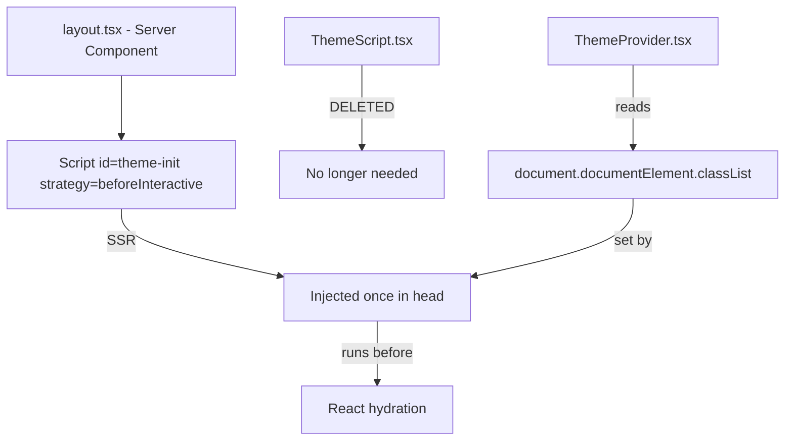

## Problem statement

The `ThemeScript` component uses `useServerInsertedHTML` to inject the anti-FOUC theme initialization script. Because `useServerInsertedHTML` fires once per RSC streaming chunk/boundary, the same 160-byte script is injected 10-14 times on every page. The home page has 14 copies; event detail pages have 13. This wastes ~2KB of HTML per page and is visible in View Source as repeated `<script>(function(){try{var t=localStorage.getItem('theme')...` blocks interspersed between RSC data chunks.

## User story

As a user, I want the app to load efficiently without redundant scripts bloating every page, so that page load is fast and the source is clean.

## How it was found

During surface-sweep review: inspected the DOM via `document.querySelectorAll("script")` and counted inline scripts containing `localStorage.getItem`. Home page: 14 duplicates. Event detail: 13. Verified in raw HTML via `curl -s http://localhost:3050/` — the theme script appears between every RSC streaming `<script>` payload.

## Proposed UX

No visible change. The theme must still initialize before first paint (no FOUC). The fix is purely in the injection method — the script should appear exactly once in the HTML.

## Acceptance criteria

- [ ] Theme init script appears exactly once in the rendered HTML (verify via `curl -s http://localhost:3050/ | grep -c "localStorage.getItem"`)
- [ ] No FOUC: dark mode preference loads instantly without flash on hard refresh
- [ ] Dark mode toggle still works
- [ ] No console errors on any page (home, event detail, 404)
- [ ] All existing tests pass
- [ ] Build succeeds

## Verification

- `curl -s http://localhost:3050/ | grep -c "localStorage.getItem('theme')"` returns 1
- `npm test` — all tests pass
- `npm run build` — succeeds
- In browser: toggle dark mode, hard refresh — no flash

## Out of scope

- Changing the theme detection logic
- Changing how ThemeProvider works
- Adding SSR theme detection

---

## Planning

### Overview

The `ThemeScript` component uses `useServerInsertedHTML` to inject the anti-FOUC theme init script. This hook fires once per RSC streaming boundary during SSR, causing 10-14 duplicate inline scripts per page. The fix: replace the `useServerInsertedHTML` pattern with `next/script` using `strategy="beforeInteractive"` and an `id` attribute, which Next.js deduplicates and injects exactly once in `<head>`.

### Research notes

- `useServerInsertedHTML` is designed for CSS-in-JS libraries that need to inject styles per streaming chunk. For a single theme init script, it's the wrong tool — it injects per chunk instead of once.
- `next/script` with `strategy="beforeInteractive"` runs before hydration and is injected exactly once. It supports `dangerouslySetInnerHTML` for inline scripts. The `id` attribute ensures deduplication.
- The existing test in `layout-preload.test.ts` line 29-34 asserts `useServerInsertedHTML` usage and no `dangerouslySetInnerHTML` in layout.tsx. This must be updated to reflect the new pattern.
- The theme init script is ~160 bytes. With 14 copies that's ~2.2KB wasted per page.

### Assumptions

- `next/script` with `strategy="beforeInteractive"` and `dangerouslySetInnerHTML` works in Next.js 16 (documented and standard pattern).
- Placing the `Script` tag in `<head>` of the layout server component is the canonical location.
- The `id="theme-init"` attribute prevents any duplicate injection.

### Architecture diagram

### One-week decision

**YES** — This is a ~20-minute change across 3 files: replace `<ThemeScript />` with `<Script>` in layout.tsx, delete `ThemeScript.tsx`, update `layout-preload.test.ts`.

### Implementation plan

1. **Update `src/app/layout.tsx`**:
   - Replace `import { ThemeScript }` with `import Script from "next/script"`
   - Define the `THEME_INIT` constant (move from ThemeScript.tsx)
   - Replace `<ThemeScript />` in `<body>` with `<Script id="theme-init" strategy="beforeInteractive" dangerouslySetInnerHTML={{ __html: THEME_INIT }} />` inside `<head>`
2. **Delete `src/components/ThemeScript.tsx`**: No longer needed
3. **Update `src/app/__tests__/layout-preload.test.ts`**:
   - Remove the test for `useServerInsertedHTML` / `ThemeScript` component
   - Add a test that layout.tsx imports `next/script` and has `id="theme-init"` with `strategy="beforeInteractive"`
   - Keep the preload-before-theme-script ordering test (update to look for `id="theme-init"` instead of `<ThemeScript`)
4. **Verify**: `curl` the page and count theme script occurrences — must be exactly 1
