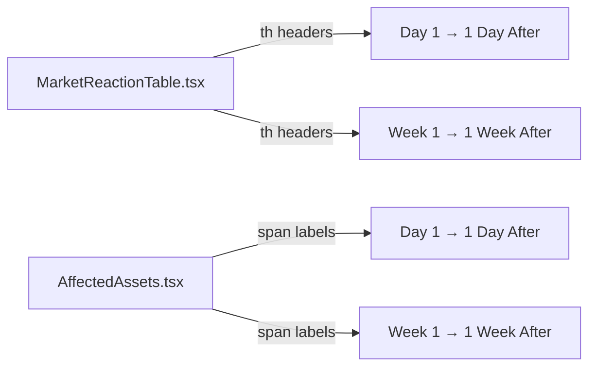

## Problem Statement

The "DAY 1" and "WEEK 1" labels appear in two places — the Consolidated Market Reaction table on the event detail page and the Affected Assets cards — but neither explains what these timeframes mean. A first-time user sees "+6.3%" under "DAY 1" and has no idea: Day 1 after *what*? These are the average price changes 1 day and 1 week after similar historical events, but that context is completely missing from the labels.

## User Story

As a first-time visitor viewing an event detail page, I want to understand what the historical reaction timeframes represent so I can evaluate the data and make informed trading decisions.

## How It Was Found

Fresh-eyes browser review of the event detail page at http://localhost:3050/event/[id]. The Consolidated Market Reaction table shows column headers "DAY 1" and "WEEK 1" with no explanation. The Affected Assets cards below repeat the same labels. A new user who has never seen the app cannot infer what these abbreviations mean without reading the narrative text above the table (which they may skip).

## Proposed UX

- In the **MarketReactionTable**, change the column headers from "DAY 1" / "WEEK 1" to "1 Day After" / "1 Week After" — this is self-explanatory about the timeframe being *after the event*.
- In the **AffectedAssets** cards, change the small labels from "Day 1" / "Week 1" to "1 Day After" / "1 Week After" to match.
- Keep the labels short and uppercase-styled to preserve the compact design.

## Acceptance Criteria

- [ ] MarketReactionTable column headers read "1 DAY AFTER" and "1 WEEK AFTER" instead of "DAY 1" and "WEEK 1"
- [ ] AffectedAssets card labels read "1 Day After" and "1 Week After" instead of "Day 1" and "Week 1"
- [ ] Labels use the same styling/sizing as current labels (no layout shifts)
- [ ] All existing tests pass
- [ ] Visually verified in browser on event detail page

## Verification

- Run `npm test` — all tests pass
- Open an event detail page in browser and verify the new labels render correctly
- Take a screenshot as evidence

## Out of Scope

- Adding tooltips or info icons to the labels
- Changing the underlying data structure
- Modifying the "Past:" label on weekly cards (separate concern)

---

## Planning

### Overview

Simple text label change in two components. The column headers in `MarketReactionTable.tsx` (lines 52–55) and the small labels in `AffectedAssets.tsx` (lines 192–199) both use ambiguous "Day 1" / "Week 1" text. Change them to "1 Day After" / "1 Week After" to be self-explanatory.

### Research Notes

- `MarketReactionTable.tsx` — two `<th>` elements at lines 51–56 with text "Day 1" and "Week 1"
- `AffectedAssets.tsx` — two `` elements at lines 192–199 with text "Day 1" and "Week 1"
- No tests assert on these exact label strings (tests focus on data rendering, not headers)
- The labels need to stay short to fit the compact table layout

### Assumptions

- "1 Day After" / "1 Week After" fits within the current column widths without layout issues

### Architecture Diagram

### One-Week Decision

**YES** — This is a pure text change in two files. Under 10 minutes of work.

### Implementation Plan

1. Update `MarketReactionTable.tsx` — change column header text from "Day 1" / "Week 1" to "1 Day After" / "1 Week After"
2. Update `AffectedAssets.tsx` — change label text from "Day 1" / "Week 1" to "1 Day After" / "1 Week After"
3. Run tests to verify nothing breaks
4. Verify visually in browser
