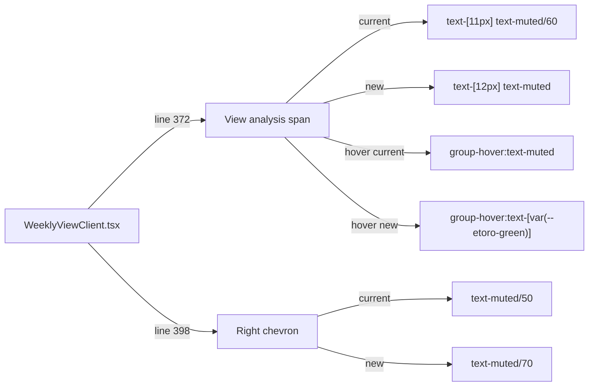

## Problem Statement

The "View analysis >" text on weekly event cards is styled at 11px with 60% muted opacity (`text-[11px] text-muted/60`). This is the primary text CTA leading users to the event detail page where historical analysis, trade buttons, and watchlist actions live. A first-time user scanning the weekly view may perceive the cards as static news entries and never discover the app's core trading features. The right-side chevron is also very subtle at `text-muted/50`.

## User Story

As a first-time visitor browsing the weekly view, I want a clear visual signal that each event card leads to deeper analysis and trading actions, so I discover the app's core value proposition without guessing.

## How It Was Found

Fresh-eyes browser review of the landing page at http://localhost:3050. The "View analysis >" text blends into the card at nearly invisible opacity. While the entire card IS a clickable link with hover effects (shadow lift, chevron animation), these only appear on hover — a user must already suspect the card is interactive to discover them.

## Proposed UX

- Increase the "View analysis" text to `text-[12px]` and change color from `text-muted/60` to `text-muted` (full muted, not 60% opacity) — this provides enough contrast to be legible without overwhelming the card.
- Change the hover state from `group-hover:text-muted` to `group-hover:text-[var(--etoro-green)]` so it reinforces the eToro brand on interaction.
- Increase the right-side chevron from `text-muted/50` to `text-muted/70` for a slightly stronger affordance.

## Acceptance Criteria

- [ ] "View analysis" text renders at 12px with `text-muted` (not 60% opacity)
- [ ] On card hover, "View analysis" text changes to eToro green
- [ ] Right-side chevron uses `text-muted/70` base color (was `text-muted/50`)
- [ ] All existing tests pass
- [ ] Visual appearance verified in browser — subtle but readable improvement

## Verification

- Run `npm test` — all tests pass
- Open http://localhost:3050 and verify the "View analysis" text is more visible
- Hover over a card and verify the text turns eToro green
- Take a screenshot as evidence

## Out of Scope

- Redesigning the card layout
- Adding additional CTA buttons to the cards
- Changing the card hover animation behavior

---

## Planning

### Overview

Adjust CSS classes on the "View analysis" text CTA and the right-side chevron in `WeeklyViewClient.tsx` to make them more discoverable for first-time users. Pure styling change — no logic or structure changes.

### Research Notes

- `WeeklyViewClient.tsx` line 372: "View analysis" span uses `text-[11px] text-muted/60 group-hover:text-muted`
- `WeeklyViewClient.tsx` line 398: right chevron uses `text-muted/50 group-hover:text-muted`
- The card is a `<Link>` component wrapping the entire card, so clickability already works
- The card has hover effects: `hover:shadow-[var(--card-shadow-hover)] hover:-translate-y-0.5`

### Assumptions

- Increasing opacity and adding green hover color won't clash with the card's existing design language

### Architecture Diagram

### One-Week Decision

**YES** — Pure CSS class adjustments on two elements. Under 10 minutes.

### Implementation Plan

1. Update the "View analysis" `` classes: `text-[11px]` → `text-[12px]`, `text-muted/60` → `text-muted`, `group-hover:text-muted` → `group-hover:text-[var(--etoro-green)]`
2. Update the right chevron classes: `text-muted/50` → `text-muted/70`
3. Run tests to verify nothing breaks
4. Verify visually in browser
