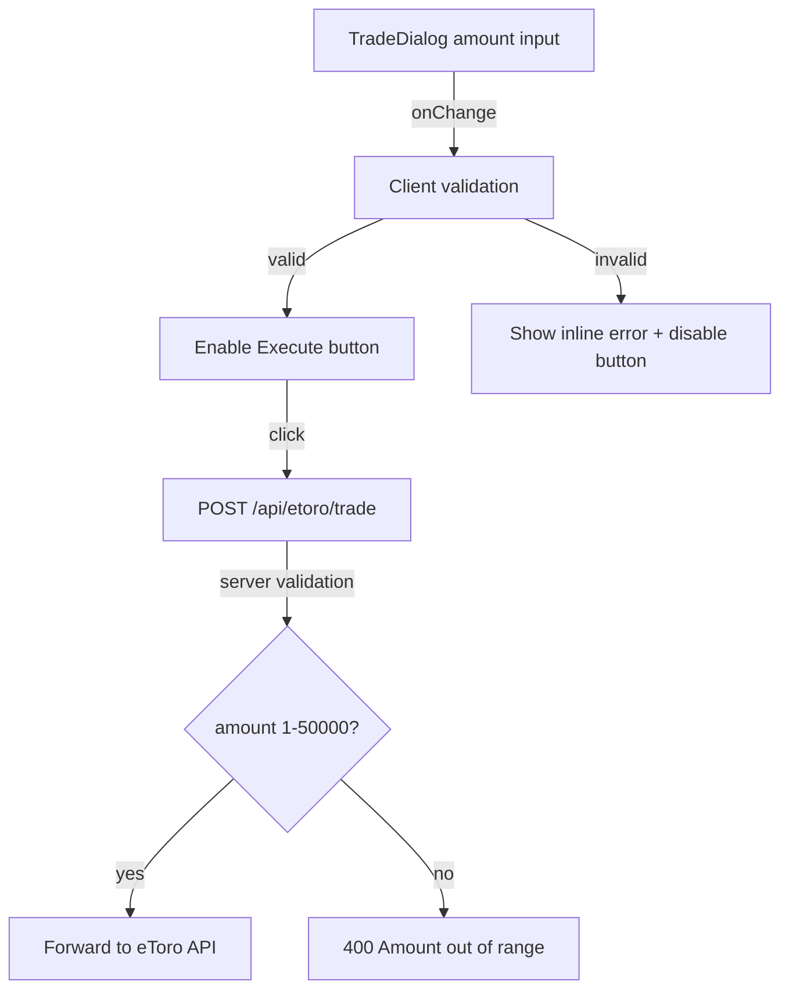

## Problem statement

The trade dialog's amount input has `min="1"` but no `max` attribute and no client-side validation beyond `Number(amount) > 0`. A user can enter amounts like `0.5`, `0.001`, or `999999999`. When the eToro API rejects an extreme amount, the error message is a generic "Trade execution failed" with no explanation of what went wrong.

Additionally, the server-side trade route at `/api/etoro/trade` only checks `amount > 0` — it enforces no upper bound or minimum trade size.

## User story

As a trader executing a demo or real trade, I want clear feedback when my amount is out of range, so that I don't submit an invalid order and get a confusing error.

## How it was found

Edge-case testing of the trade dialog. The amount input accepts any positive number including fractions below $1 and values above $100,000. eToro's minimum trade amount is typically $10-50 depending on the instrument. Submitting extreme values would hit the eToro API and fail with a generic error.

## Proposed UX

- Set `min="1"` and `max="50000"` on the amount input element.
- Show inline validation text below the input when the value is out of range: "Minimum amount is $1" or "Maximum amount is $50,000".
- Disable the "Execute Trade" button when the amount is invalid.
- On the server side, add validation: `amount >= 1 && amount <= 50000` in the trade route, returning 400 with a clear message.

## Acceptance criteria

- [ ] Amount input has `max="50000"` attribute
- [ ] Client-side validation shows inline error for amounts < 1 or > 50,000
- [ ] Execute Trade button is disabled when amount is out of range
- [ ] Server route returns 400 with descriptive message for out-of-range amounts
- [ ] Existing tests still pass
- [ ] Verified in browser with agent-browser

## Out of scope

- Dynamic per-instrument minimum amounts from eToro API
- Currency conversion or non-USD amounts

## Research notes

- eToro minimum trade amount varies by instrument but is typically $10 for stocks, $25 for crypto. Using $1 as minimum keeps it simple and universal.
- Browser `type="number"` with `max` attribute provides native validation but does not block form submission via JS click handlers (only via form submit). Client-side JS validation is required.
- The trade route at `src/app/api/etoro/trade/route.ts` line 48 checks `amount > 0` but has no upper bound.

## Architecture diagram

## One-week decision

**YES** — This is a straightforward validation change in two files (TradeDialog.tsx and route.ts). Under 1 hour of work.

## Implementation plan

### Phase 1: Client-side validation (TradeDialog.tsx)
1. Add constants `MIN_AMOUNT = 1` and `MAX_AMOUNT = 50000`
2. Add `max="50000"` to the input element
3. Derive `amountError` from the current value: show "Minimum $1" / "Maximum $50,000" as needed
4. Show error text below the input when invalid
5. Include amount validity in the disabled check for the Execute button

### Phase 2: Server-side validation (route.ts)
1. Change the amount check from `amount <= 0` to `amount < 1 || amount > 50000`
2. Return descriptive 400 error: "Amount must be between $1 and $50,000"

### Phase 3: Tests
1. Add test cases for boundary values (0, 0.5, 1, 50000, 50001) in the trade route test file
