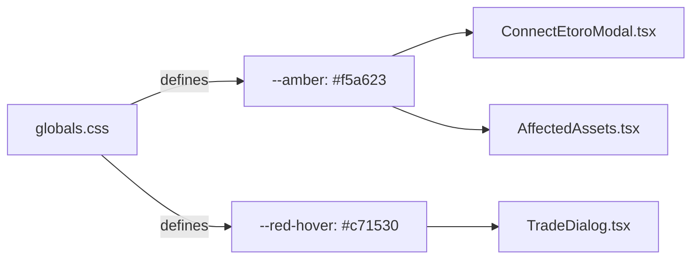

## Problem statement

Several components use hardcoded hex color values instead of CSS custom properties, violating the project constraint that "CSS custom properties for all design tokens" must be used everywhere. Specifically:

- `ConnectEtoroModal.tsx` line 128: `text-[#f5a623]` for warning text
- `AffectedAssets.tsx` lines 127-128: `text-[#f5a623]` and `bg-[#f5a623]/10` for watchlist star
- `TradeDialog.tsx` line 169: `hover:bg-[#c71530]` for real-mode button hover

These hardcoded values break theming consistency and make it harder to adjust the palette centrally.

## User story

As a developer maintaining the design system, I want all color values defined as CSS custom properties, so that theme changes propagate consistently across all components.

## How it was found

Code review during edge-case testing of the connect modal, trade dialog, and watchlist interactions. Spotted hardcoded hex values that bypass the CSS variable system.

## Proposed UX

- Add `--amber` (or `--warning`) CSS variable for `#f5a623` in the global theme definition.
- Add `--red-hover` CSS variable for `#c71530` in the global theme definition.
- Replace all hardcoded hex references with the new CSS variables.
- Both light and dark mode variants should define appropriate values.

## Acceptance criteria

- [ ] No hardcoded `#f5a623` or `#c71530` in any component file
- [ ] New CSS custom properties defined in globals.css for both themes
- [ ] Visual appearance unchanged (same colors render)
- [ ] All tests pass
- [ ] Verified visually in both light and dark mode

## Out of scope

- Auditing the entire codebase for other hardcoded colors (focus on the 3 specific files)
- Changing the actual color values

## Research notes

- The project uses CSS custom properties in `src/app/globals.css` for theming. Existing variables include `--etoro-green`, `--red`, `--error-bg`, `--success-bg`, etc.
- `#f5a623` is an amber/gold color used for the watchlist star and warning text. Needs a new variable like `--amber` or `--warning`.
- `#c71530` is a darker red used for hover on the real-trade button. Needs a variable like `--red-hover`.
- Both light and dark mode `:root` blocks define theme-specific values.

## Architecture diagram

## One-week decision

**YES** — Purely a find-and-replace task across 3 component files plus adding 2 CSS variables. Under 30 minutes.

## Implementation plan

### Phase 1: Add CSS variables
1. In `globals.css`, add `--amber` and `--red-hover` to both `:root` (light) and `.dark` theme blocks

### Phase 2: Replace hardcoded values
1. `ConnectEtoroModal.tsx`: replace `#f5a623` → `var(--amber)`
2. `AffectedAssets.tsx`: replace `#f5a623` → `var(--amber)` (2 occurrences + the /10 opacity variant)
3. `TradeDialog.tsx`: replace `#c71530` → `var(--red-hover)`

### Phase 3: Verify
1. Visual check in both light and dark mode — colors should be identical
