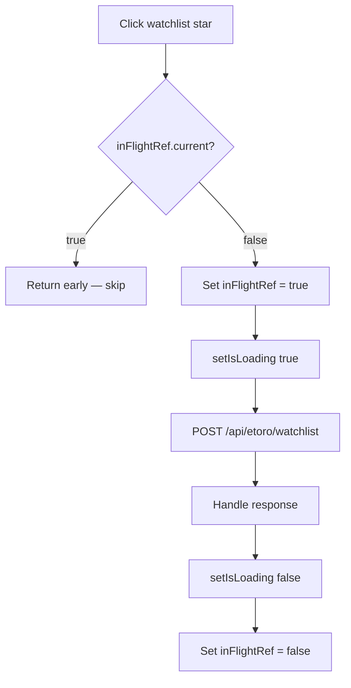

## Problem statement

The WatchlistStar component in `AffectedAssets.tsx` uses `isLoading` state to disable the button during API calls. However, because React state updates are batched and don't take effect until the next render, rapid double-clicks within the same event loop tick can fire multiple `POST /api/etoro/watchlist` requests before `isLoading` becomes `true` in the DOM.

The result: duplicate "Added to watchlist" toasts and wasted API calls against the user's rate limit quota.

## User story

As a trader quickly starring assets, I want each click to fire exactly one API call, so that I don't see duplicate notifications or burn through my rate limit.

## How it was found

Edge-case testing: rapidly double-clicking the watchlist star button on the event detail page. While the `disabled` attribute eventually prevents further clicks, the brief window between clicks allows duplicate requests.

## Proposed UX

Use a ref (`useRef`) to track in-flight state synchronously, checking it at the top of the click handler before the async work begins. This closes the race window because ref mutations are synchronous and don't wait for a re-render.

## Acceptance criteria

- [ ] Rapid double-clicking the watchlist star fires exactly one API call
- [ ] Single normal clicks still work correctly
- [ ] Loading spinner still appears during the API call
- [ ] Success/error toasts appear once, not duplicated
- [ ] Existing tests still pass

## Out of scope

- Adding remove-from-watchlist (toggle) functionality
- Persisting watchlist state across page navigations

## Research notes

- The `WatchlistStar` component in `src/components/AffectedAssets.tsx` (lines 84-139) uses `useState(false)` for `isLoading`.
- React batches state updates within event handlers, so `setIsLoading(true)` doesn't take effect until the next render. Rapid clicks between renders bypass the `disabled` prop.
- Standard pattern: use a `useRef(false)` as a synchronous in-flight guard, checked and set at the top of the handler before any async work.
- The `TradeButton` component doesn't have this issue because it opens a dialog first (requires a second deliberate click).

## Architecture diagram

## One-week decision

**YES** — Adding a single `useRef` guard to one component. Under 15 minutes.

## Implementation plan

### Phase 1: Add ref guard
1. Add `const inFlightRef = useRef(false)` to `WatchlistStar`
2. At the top of `handleClick`, add: `if (inFlightRef.current) return;`
3. Set `inFlightRef.current = true` before the async work
4. Set `inFlightRef.current = false` in the `finally` block

### Phase 2: Verify
1. Ensure existing tests pass
2. Manual test: rapid double-click should only fire one API request
