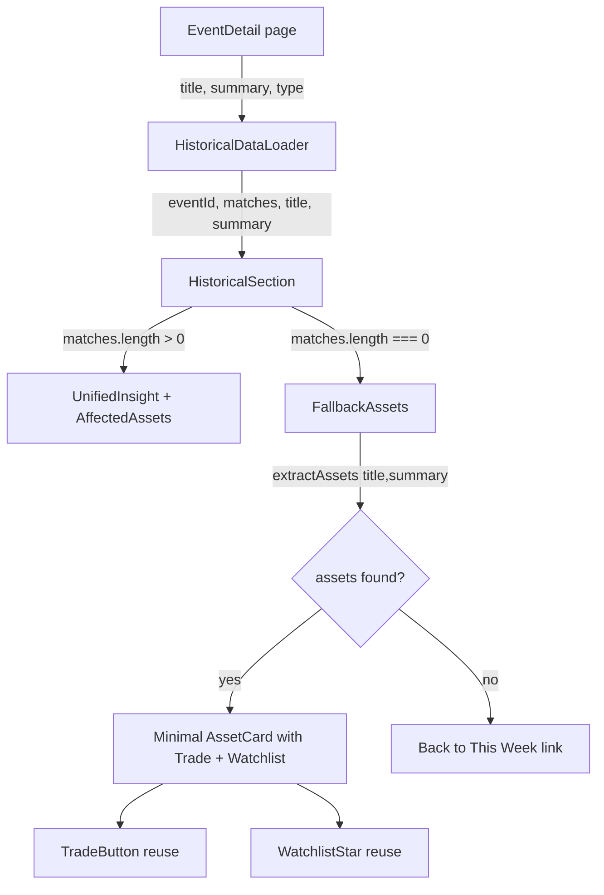

## Problem statement

When an event has no historical parallels (common for today's event), the event detail page shows only a single text line — "No historical parallels found for this event." — with zero actionable elements below. The user journey ends in a dead end: no Trade button, no Watchlist star, no suggestion to explore other events.

This is especially impactful because today's event (the most prominent card on the weekly view, marked with a "TODAY" badge) frequently has no historical matches yet. The core user path — see today's event → read analysis → trade — breaks completely.

## User story

As a user clicking on today's event card, I want to still be able to trade the mentioned asset even if historical parallels haven't been found, so that the app's value proposition isn't broken for the freshest, most relevant news.

## How it was found

Browser testing via agent-browser: navigated to the UBS earnings event (2026-04-29, `live-global-1-2026-04-29`). The event detail page showed only "No historical parallels found for this event." with no further CTA or guidance. Screenshot: `review-screenshots/246-event-detail-top.png`, `review-screenshots/247-event-detail-bottom.png`.

The API confirms: `GET /api/events/live-global-1-2026-04-29` returns `historicalMatches: []` and `keyReaction: null`.

## Proposed UX

When `historicalMatches` is empty, instead of a dead-end text message:

1. Show the existing "No historical parallels" text but make it more helpful: "No historical parallels found yet. Analysis updates throughout the day."
2. Below it, if the event title mentions a tradeable asset (e.g., "UBS", "Tesla"), extract and display a minimal "Affected Assets" card with just the asset name, a Trade CTA, and a Watchlist star — without the historical performance data (hide the "1 DAY AFTER / 1 WEEK AFTER" columns).
3. Parse the asset from the event by checking the event title + summary against the `etoro-slugs` mapping. If no asset can be extracted, show a "Browse events with analysis" link back to the weekly view (maybe anchor to the first event with `keyReaction`).

## Acceptance criteria

- [ ] Event detail page with empty `historicalMatches` shows an improved empty state message
- [ ] If an asset can be extracted from the event title/summary, a Trade CTA and Watchlist star appear
- [ ] Trade CTA for extracted asset opens connect modal (when not connected) or trade dialog (when connected)
- [ ] Watchlist star works the same as on events with full historical data
- [ ] If no asset can be extracted, a "Browse events with analysis" link is shown
- [ ] No regression for events that DO have historical parallels

## Verification

- Run all tests
- Navigate to today's event (which has no historical parallels) and verify the fallback CTA appears
- Click Trade button and verify it opens the Connect modal
- Take a screenshot as evidence

## Out of scope

- Changing how the historical matching engine works
- Adding loading/retry state for historical matching (already exists)
- Modifying the weekly view cards (separate task)

---

## Planning

### Overview

When `HistoricalSection` receives an empty `matches` array, it renders a dead-end message. We need to extract tradeable asset names from the event context and render minimal asset cards with Trade/Watchlist CTAs, reusing existing components from `AffectedAssets.tsx`.

### Research notes

- `etoro-slugs.ts` has `ASSET_TO_SLUG` with ~30 asset name keys that can be matched against event text
- `AffectedAssets.tsx` has `TradeButton`, `WatchlistStar`, and `AssetCard` components — currently not exported individually but can be extracted or duplicated
- `HistoricalSection` currently receives only `eventId` and `matches` — needs additional props for event title/summary to enable asset extraction
- The event detail page (`src/app/event/[id]/page.tsx`) passes event data to `HistoricalDataLoader` which already has title/summary access

### Assumptions

- Asset extraction from title/summary is best-effort — some events won't mention any known eToro-tradeable asset
- "UBS" is not in the current `ASSET_TO_SLUG` mapping so the UBS event specifically won't show a trade card (but events mentioning Tesla, Oil, Gold, etc. will)
- We add a few common stock tickers to the slugs map (UBS, Robinhood/HOOD) to increase coverage

### Architecture diagram

### One-week decision

**YES** — This is a focused UI change in 2-3 files with clear boundaries. ~2-3 hours of work.

### Implementation plan

1. **Create `extractAssetsFromText` utility** in `src/lib/etoro-slugs.ts` — scan text for known asset names from `ASSET_TO_SLUG` keys, return array of matched names
2. **Add `UBS` and `Robinhood` to `ASSET_TO_SLUG`** — increases coverage for common earnings events (UBS → `ubsg.z`, Robinhood → `hood`)
3. **Export `WatchlistStar` and `TradeButton` from `AffectedAssets.tsx`** — they are currently module-private; export them so `HistoricalSection` can reuse
4. **Extend `HistoricalSection` props** — add `eventTitle` and `eventSummary` string props
5. **Update the empty-state branch in `HistoricalSection`** — replace the dead-end text with improved message + fallback asset cards (minimal: name, Trade, Watchlist — no performance data)
6. **Update `HistoricalDataLoader` in event detail page** — pass title/summary through to `HistoricalSection`
7. **Update tests** — update `HistoricalSection.test.tsx` to cover the new fallback state
