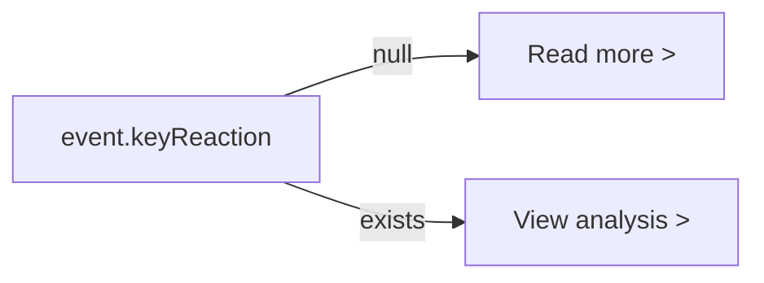

## Problem statement

Every event card on the weekly view shows "View analysis >" as its CTA text, regardless of whether the event actually has historical analysis available. For events without historical parallels (identified by `keyReaction: null` in the API response), clicking "View analysis" leads to a page that says "No historical parallels found for this event." — breaking user expectations.

Today's event card is the most prominent (marked with "TODAY" badge) and almost always lacks analysis. The CTA promises analysis that doesn't exist.

## User story

As a user scanning the weekly view, I want the CTA text on each event card to accurately reflect what I'll find on the detail page, so that I can prioritize which events to explore and am not disappointed by empty pages.

## How it was found

Browser testing via agent-browser: on the weekly view, the UBS earnings card (today's event) shows "View analysis >" but the detail page has no analysis. Meanwhile, the Robinhood card (which shows "Past: Tesla -4.2%") correctly has analysis on its detail page. The `keyReaction` field in the API response is the signal: it's `null` when no historical parallels exist.

Screenshots: `review-screenshots/244-landing.png` (weekly view), `review-screenshots/246-event-detail-top.png` (empty detail).

## Proposed UX

- Events WITH `keyReaction` (i.e., have historical data): keep "View analysis >"
- Events WITHOUT `keyReaction` (no historical parallels): show "Read more >" instead

This is a one-line conditional change in `WeeklyViewClient.tsx` at line 373.

## Acceptance criteria

- [ ] Weekly cards with `keyReaction` show "View analysis >"
- [ ] Weekly cards without `keyReaction` show "Read more >"
- [ ] No visual regression — the CTA text style, chevron icon, and hover state remain identical
- [ ] Existing tests pass

## Verification

- Run all tests
- Open the weekly view and verify today's event card (which has `keyReaction: null`) shows "Read more >"
- Verify another card with historical data still shows "View analysis >"
- Take a screenshot as evidence

## Out of scope

- Changing the event detail page content (separate task)
- Adding new data to the weekly card display
- Modifying navigation behavior

---

## Planning

### Overview

A one-line conditional change in `WeeklyViewClient.tsx` — use `event.keyReaction` as the signal to differentiate CTA text between "View analysis" and "Read more".

### Research notes

- `WeeklyViewClient.tsx` line 373: hardcoded `View analysis` CTA text
- `event.keyReaction` is `null` for events without historical data, non-null when data exists
- The `keyReaction` presence already controls whether the "Past: ▲ Asset +X.X%" line shows on the card (line 355-371)
- No test file directly tests the CTA text in WeeklyViewClient

### Architecture diagram

### One-week decision

**YES** — Single line change. ~15 minutes including testing.

### Implementation plan

1. In `WeeklyViewClient.tsx`, change line 373 from hardcoded `View analysis` to `{event.keyReaction ? "View analysis" : "Read more"}`
2. Verify visually in the browser
