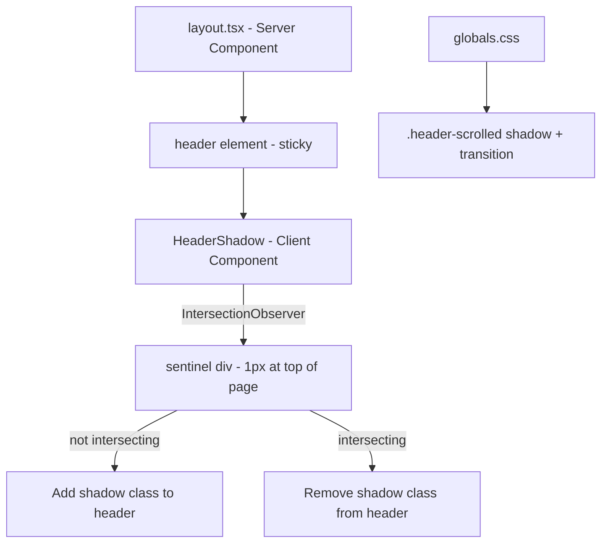

## Problem statement

The sticky header has `position: sticky` and a thin `border-b` separator, but no box-shadow. When users scroll down, content slides behind the header with no visual indication of depth — the header and content below it appear on the same plane. This makes the interface feel flat compared to professional trading apps (eToro, Bloomberg, TradingView) that all add a subtle shadow or elevation when the header becomes "stuck."

Confirmed via `getComputedStyle(header).boxShadow === "none"` on the live app, and screenshots #260 and #273 showing no shadow when scrolled.

## User story

As a user scrolling through the weekly view or event details, I want the sticky header to visually separate from the content so that it's clear the header is fixed and the content is scrolling behind it.

## How it was found

Browser inspection during visual-polish review. Scrolled down on the weekly view (screenshot #273) and observed the header has no shadow — just a thin 1px border separating it from content. Compared to eToro.com and TradingView, both of which add an elevated shadow when their header becomes sticky.

## Proposed UX

- When the page is scrolled to the top (scrollY === 0), the header has just its existing border, no shadow.
- When the page is scrolled down (scrollY > 0), add a subtle shadow: `box-shadow: 0 1px 3px rgba(0,0,0,0.08)` (light mode) / `box-shadow: 0 1px 3px rgba(0,0,0,0.3)` (dark mode).
- Use CSS-only approach if possible (e.g., a pseudo-element or scroll-driven animation) to avoid JS overhead. Alternatively, a thin `IntersectionObserver` sentinel approach is acceptable.
- Transition should be smooth (150ms ease).

## Acceptance criteria

- [ ] Header has no shadow when page is at the top
- [ ] Header gains a subtle shadow when page is scrolled down
- [ ] Shadow appearance/disappearance is animated smoothly
- [ ] Works correctly in both light and dark themes
- [ ] No layout shift or visual glitch during transition
- [ ] All existing tests pass

## Verification

- Run test suite: `npm test`
- Build: `npm run build`
- Visual check with agent-browser: scroll down and screenshot to confirm shadow appears

## Out of scope

- Changing the header height, padding, or layout
- Adding any content to the header
- Changing header background color

---

## Planning

### Overview

Add a scroll-dependent shadow to the sticky header in `src/app/layout.tsx`. The header currently uses `sticky top-0 z-10` with a `border-b` separator div. We need to detect scroll position and conditionally apply a box-shadow with smooth transition.

### Research notes

- The header is a server component in `layout.tsx` (line 46-61). It renders a `<header>` with a `
` child.
- CSS-only scroll-driven animations (`animation-timeline: scroll()`) have limited browser support (~85% as of 2026) — not safe for production.
- Best approach: Create a tiny client component `ScrollShadow` that uses `IntersectionObserver` on a sentinel element placed just before the header. When the sentinel scrolls out of view, add a class to the header.
- Alternative simpler approach: Use a CSS `::after` pseudo-element with a gradient shadow that's always present, leveraging the existing `border-b` div. But this doesn't respond to scroll state.
- Chosen approach: Create a `HeaderShadow` client component that wraps or augments the header element with scroll detection via `IntersectionObserver`. This is the most reliable cross-browser approach with minimal JS.

### Architecture diagram

### One-week decision

**YES** — This is a small task: one client component (~20 lines), one CSS rule, and a minor layout change. Easily done in under a day.

### Implementation plan

1. Add a `.header-scrolled` class in `globals.css` with the shadow and transition
2. Create a `HeaderShadow` client component in `src/components/HeaderShadow.tsx`:
   - Renders a 1px sentinel `
` at the top of the page
   - Uses `IntersectionObserver` to detect when the sentinel leaves the viewport
   - Toggles a data attribute or class on the `<header>` element
3. Add the `HeaderShadow` component to `layout.tsx` just before the header
4. Run tests and build to verify no regressions
