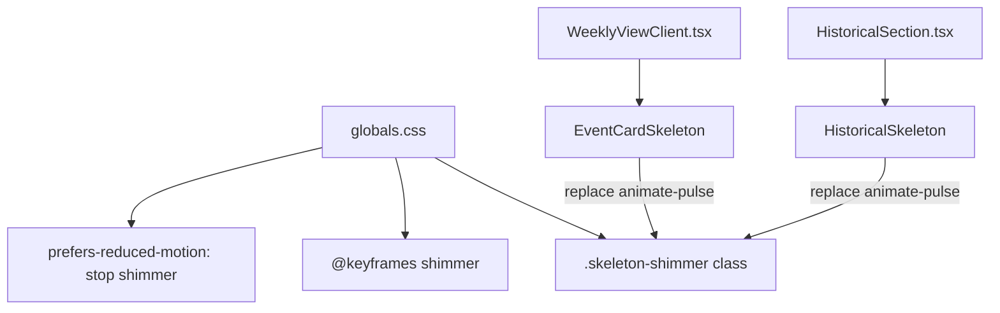

## Problem statement

The loading skeletons in the weekly view (EventCardSkeleton) and event detail page (HistoricalSkeleton) use Tailwind's `animate-pulse` — a simple opacity blink. Professional trading apps and modern web apps use a gradient shimmer effect that sweeps horizontally across skeleton elements, providing a more polished loading experience. The current pulse animation looks basic and dated compared to production-quality apps.

## User story

As a user waiting for content to load, I want the loading skeleton to have a smooth shimmer animation so that the app feels polished and professional during loading states.

## How it was found

Visual inspection during the visual-polish review. Observed the loading skeleton in WeeklyViewClient.tsx (EventCardSkeleton) and HistoricalSection.tsx (HistoricalSkeleton) both use `animate-pulse`. Compared to eToro.com's loading states which use a gradient shimmer sweep effect.

## Proposed UX

- Replace `animate-pulse` with a shimmer keyframe animation:
  - A subtle gradient highlight sweeps from left to right across each skeleton element
  - Use a CSS `@keyframes shimmer` with `background: linear-gradient(90deg, transparent 0%, rgba(255,255,255,0.08) 50%, transparent 100%)` (adjusted for light/dark mode)
  - Animation duration: ~1.5s, infinite loop, ease-in-out
- Apply to both EventCardSkeleton and HistoricalSkeleton
- Keep the same skeleton shape/dimensions — only change the animation

## Acceptance criteria

- [ ] EventCardSkeleton uses shimmer animation instead of animate-pulse
- [ ] HistoricalSkeleton uses shimmer animation instead of animate-pulse
- [ ] Shimmer looks good in both light and dark themes
- [ ] Animation respects `prefers-reduced-motion` (falls back to static or pulse)
- [ ] No layout shift or visual changes to skeleton dimensions
- [ ] All existing tests pass

## Verification

- Run test suite: `npm test`
- Build: `npm run build`
- Visual check: trigger loading state (switch scope or navigate) and verify shimmer effect

## Out of scope

- Changing skeleton element shapes or sizes
- Adding new skeleton components
- Modifying the loading logic or timing

---

## Planning

### Overview

Replace the `animate-pulse` animation on skeleton loading states with a shimmer gradient sweep effect. Affects `EventCardSkeleton` in `src/components/WeeklyViewClient.tsx` (line 13-32) and `HistoricalSkeleton` in `src/components/HistoricalSection.tsx` (line 17-41).

### Research notes

- Current skeleton elements use Tailwind's `animate-pulse` class (opacity 0→100% blink).
- Shimmer pattern: a translucent gradient band sweeps left-to-right across the element using `background-size: 200% 100%` and `background-position` animation.
- Light mode shimmer uses `rgba(255,255,255,0.5)` highlights; dark mode uses `rgba(255,255,255,0.05)`.
- The `prefers-reduced-motion` media query already has a block in `globals.css` (line 162-166) for `.card-enter`. The shimmer animation should also respect this.
- Skeleton child elements (the `bg-foreground/5` rectangles) should have the shimmer applied. The parent wrapper can stay as-is.

### Architecture diagram

### One-week decision

**YES** — This is a CSS-only change plus replacing class names. Under a day of work.

### Implementation plan

1. Add `@keyframes shimmer` in `globals.css`:
   - Animate `background-position` from `200% 0` to `-200% 0`
   - Duration 1.5s, infinite, ease-in-out
2. Add `.skeleton-shimmer` utility class that applies the shimmer background gradient
3. Add `prefers-reduced-motion` override to disable shimmer animation
4. In `WeeklyViewClient.tsx`: Replace `animate-pulse` on the EventCardSkeleton wrapper with `skeleton-shimmer`
5. In `HistoricalSection.tsx`: Replace `animate-pulse` on the HistoricalSkeleton wrapper with `skeleton-shimmer`
6. Run tests and build to verify no regressions
