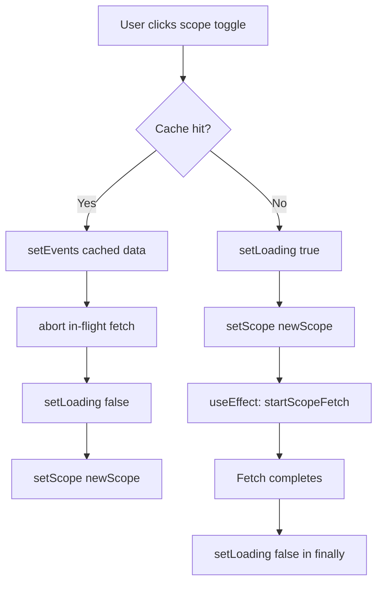

## Problem Statement

When users rapidly toggle between Global and UK/DE/FR scope multiple times within ~1 second, the weekly view gets permanently stuck showing loading skeletons. The data never loads and users must do a full page refresh to recover.

Root cause: In `WeeklyViewClient.tsx`, `handleScopeChange` has two paths:
1. **Cache miss**: sets `loading=true` and `setScope(newScope)` (which triggers a fetch via useEffect)
2. **Cache hit**: sets `events` and `scope` but **never calls `setLoading(false)`**

When toggling: Local (cache miss → loading=true → fetch starts) → Global (cache hit → events updated, loading stays true) → the fetch from step 1 may be aborted or its result arrives for the wrong scope, and loading is never reset.

## User Story

As a user toggling between Global and Local scope, I want the event list to always resolve and show data, so that I don't have to refresh the page to recover from a stuck loading state.

## How It Was Found

Observed in browser using agent-browser. Rapidly clicking Global → UK/DE/FR → Global → UK/DE/FR four times within ~1 second caused permanent skeleton display. Full page refresh was required to recover. Screenshot: `review-screenshots/289-after-rapid-toggle-wait.png`

## Proposed Fix

In `handleScopeChange`, when the cache-hit path is taken, explicitly call `setLoading(false)` to ensure loading state is always reset when data is available.

```tsx
if (cached) {
  setEvents(cached);
  confirmedScope.current = newScope;
  setScope(newScope);
  setLoading(false);  // <-- add this
}
```

Also cancel any in-flight fetch when cache is used, to prevent stale results from a previous toggle arriving and overwriting the correct data:

```tsx
if (cached) {
  if (abortControllerRef.current) {
    abortControllerRef.current.abort();
  }
  setEvents(cached);
  confirmedScope.current = newScope;
  setScope(newScope);
  setLoading(false);
}
```

## Acceptance Criteria

- [ ] Rapid scope toggling (4+ times in <1 second) never leaves the page stuck on skeletons
- [ ] After rapid toggling, the correct scope's data is displayed
- [ ] The selected scope indicator matches the displayed data
- [ ] Normal (slow) toggling still works correctly
- [ ] All existing tests pass

## Verification

- Run `npm test` — all tests pass
- Open app in browser, rapidly toggle scope 4+ times, verify data always renders
- Take a screenshot as evidence

## Out of Scope

- Debouncing the toggle clicks (users should be free to click rapidly)
- Changing the caching strategy

---

## Planning

### Overview

A single-file bug fix in `WeeklyViewClient.tsx`. The `handleScopeChange` callback has a cache-hit path that updates events and scope but fails to reset `loading` to false, and doesn't abort in-flight fetches. When rapid toggling interleaves cache-hit and cache-miss paths, `loading` stays true permanently.

### Research Notes

- React 18+ batches state updates in event handlers but `useEffect` runs after each render cycle.
- The `abortControllerRef` pattern is correct for cancelling fetches, but the cache-hit path never touches it.
- The `useEffect` for scope changes has `getCachedData(scope)` as an early return, which correctly skips fetching when cache is available — but doesn't reset loading either.
- The `finally()` handler only resets loading if `!controller.signal.aborted`, which means aborted fetches never reset loading.

### Assumptions

- The fix is isolated to `handleScopeChange` in `WeeklyViewClient.tsx`.
- No API changes needed.

### Architecture Diagram



### One-Week Decision

**YES** — This is a 2-line fix in a single function within one file. Implementation + tests can be done in under an hour.

### Implementation Plan

1. In `handleScopeChange`, add `setLoading(false)` in the cache-hit branch
2. In the same branch, abort any in-flight controller to prevent stale data from arriving
3. Add/update tests to verify rapid toggling doesn't leave loading stuck
4. Verify all existing tests pass
