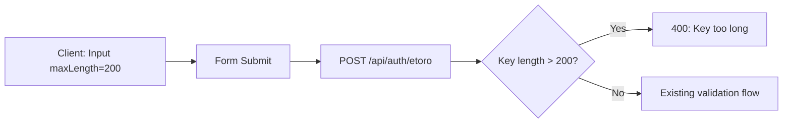

## Problem Statement

The eToro Connect modal's API Key and User Key inputs accept arbitrarily long strings — tested with a 5000-character input that was accepted and submitted successfully. Real eToro API keys are ~40-100 characters. Accepting oversized keys creates two problems:

1. **Cookie overflow**: The encrypted keys are stored in an httpOnly cookie. Browsers limit cookies to ~4KB. A 5000-char API key + user key, once encrypted, can easily exceed this limit, causing the cookie to silently fail or be truncated.
2. **Unnecessary server load**: Encrypting and decrypting very large strings wastes CPU cycles.

## User Story

As a user connecting my eToro account, I want the input fields to prevent me from pasting unreasonably long keys, so that the connection doesn't silently fail due to cookie size limits.

## How It Was Found

Observed in browser using agent-browser. Filled the Public API Key field with a 5000-character string. The form accepted and submitted it, showing "Connected" status. Screenshot: `review-screenshots/276-long-key-input.png`

## Proposed Fix

1. Add `maxLength={200}` to both key input fields in `ConnectEtoroModal.tsx` — generous enough for any valid key but prevents absurd inputs.
2. Add server-side validation in `/api/auth/etoro/route.ts` to reject keys longer than 200 characters with a clear error message.

## Acceptance Criteria

- [ ] Both input fields have `maxLength={200}`
- [ ] Server-side API rejects keys longer than 200 characters with a 400 status and descriptive error
- [ ] Normal-length keys (40-100 chars) are accepted without issue
- [ ] All existing tests pass

## Verification

- Run `npm test` — all tests pass
- Open Connect modal, try pasting >200 character key — input is truncated
- Verify normal key entry still works

## Out of Scope

- Validating the exact format of eToro API keys (hex, UUID, etc.)
- Adding a character counter to the input fields

---

## Planning

### Overview

Add input length limits to prevent absurdly long API keys from being submitted and stored in cookies. Two touch points: client-side `maxLength` on inputs and server-side length validation.

### Research Notes

- Browser cookies have a ~4KB size limit per cookie. The encrypted payload for two 5000-char keys would far exceed this.
- eToro API keys in practice are UUID-like strings or hex tokens, typically 32-128 characters.
- HTML `maxLength` attribute prevents typing beyond the limit; paste is also truncated.
- Server-side validation is needed to prevent direct API calls that bypass the form.

### Assumptions

- 200 characters is a safe maximum — well above any real key length while preventing abuse.
- No need to validate key format (hex, UUID, etc.) since the validation endpoint handles that.

### Architecture Diagram

### One-Week Decision

**YES** — Two files to modify, ~5 lines of code total. Under 30 minutes including tests.

### Implementation Plan

1. Add `maxLength={200}` to both input elements in `ConnectEtoroModal.tsx`
2. Add server-side length check in `/api/auth/etoro/route.ts` — after the empty-string checks, add length > 200 check returning 400
3. Add test for server-side rejection of oversized keys
4. Verify all existing tests pass
