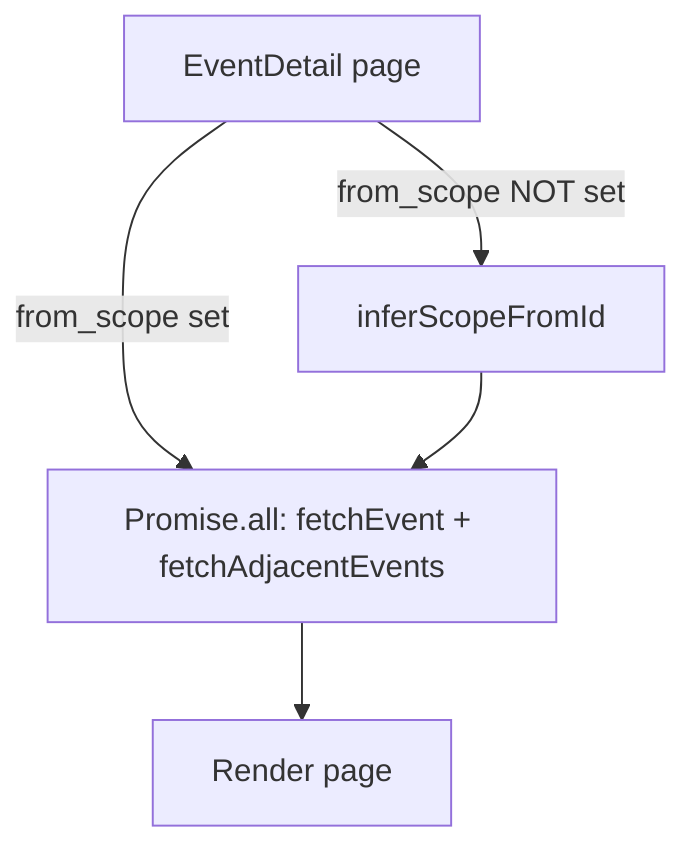

## Problem statement

When a user navigates to an event detail page via a shared or bookmarked URL (without `from_scope` query param), the page fetches data sequentially: first `fetchEvent(id)`, waits for it, reads the scope from the result, then `fetchAdjacentEvents(id, scope)`. This creates a ~1s waterfall on cold loads.

When `from_scope` IS provided (normal weekly view navigation), both fetches run in parallel via `Promise.all`. But direct URL access misses this optimization.

The scope can be inferred from the event ID itself (`live-global-*` → "global", `live-local-*` → "local"), eliminating the need to wait for the event fetch before starting the adjacent events fetch.

## User story

As a user who opens a shared event link, I want the page to load as fast as possible so I can quickly see the analysis and trade.

## How it was found

Performance profiling during browser testing. Measured event detail cold load at ~1.2s. The sequential fetch pattern in `src/app/event/[id]/page.tsx` lines 86-94 shows the waterfall: `fetchEvent` → extract scope → `fetchAdjacentEvents`. With parallelization this could be ~600ms.

## Proposed UX

No visual change. The event detail page loads faster on direct URL access — the header, hero image, and historical section all appear sooner.

## Acceptance criteria

- [ ] When `from_scope` is NOT in the URL, infer scope from the event ID prefix (`live-global-*` → "global", `live-local-*` → "local", default to "global" for mock events)
- [ ] Both `fetchEvent` and `fetchAdjacentEvents` run in parallel via `Promise.all` for all code paths
- [ ] All existing tests pass
- [ ] No change to the rendered output — only timing improvement

## Verification

- Run all tests: `npm test`
- Verify event detail pages render correctly with and without `from_scope`

## Out of scope

- Changing the ISR revalidation timing
- Adding client-side caching for event detail
- Changing the historical data loading (already uses Suspense)

---

## Planning

### Overview

Single-file change in `src/app/event/[id]/page.tsx`. The `else` branch (lines 86-94) currently waits for `fetchEvent` to complete before calling `fetchAdjacentEvents`. By extracting scope from the event ID prefix, both calls can run in parallel.

### Research notes

- Event IDs follow the pattern `live-{scope}-{index}-{date}` for live events, or a slug like `mock-...` for mock events
- `fetchAdjacentEvents` only needs the scope string, which is derivable from the ID
- Both `fetchEvent` and `fetchAdjacentEvents` use `React.cache()` for deduplication
- Mock events don't have a scope prefix — defaulting to "global" is correct since mock data is global-only

### Architecture diagram

### One-week decision

**YES** — This is a ~10 line change in a single file. Extract a `inferScopeFromId` helper, use it in the else branch, and run `Promise.all`.

### Implementation plan

1. Add a helper function `inferScopeFromId(id: string): "global" | "local"` that parses the event ID prefix
2. Refactor the else branch to use `Promise.all([fetchEvent(id), fetchAdjacentEvents(id, inferScopeFromId(id))])` 
3. Run tests to verify no regressions
