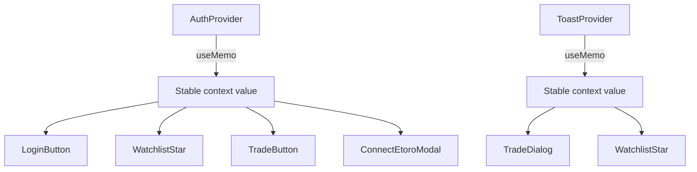

## Problem statement

AuthProvider and ToastProvider create new context value objects on every render. When any state in AuthProvider changes (e.g., `isLoading: true → false` on mount, `showConnectModal` toggling), ALL consumers re-render — including every WatchlistStar and TradeButton in the Affected Assets grid, LoginButton, and ConnectEtoroModal.

This causes unnecessary re-render work especially during trade/watchlist interactions where the user expects immediate feedback.

## User story

As a trader interacting with trade buttons and watchlist stars, I want the UI to respond instantly without unrelated components visually re-rendering.

## How it was found

Code review during performance-focused iteration. AuthProvider at `src/components/AuthProvider.tsx` line 93 creates `{ isConnected, isLoading, showConnectModal, openConnectModal, closeConnectModal, connect, disconnect }` as a new object literal on every render. ToastProvider at `src/components/ToastProvider.tsx` line 48 creates `{ toast }` as a new object literal. Neither uses `useMemo`.

## Proposed UX

No visible change. Interactions with trade buttons and watchlist stars feel snappier because fewer components re-render when auth/toast state changes.

## Acceptance criteria

- [ ] AuthProvider wraps its context value in `useMemo` with proper dependency array `[isConnected, isLoading, showConnectModal, openConnectModal, closeConnectModal, connect, disconnect]`
- [ ] ToastProvider wraps its context value in `useMemo` with `[toast]` dependency
- [ ] All existing tests pass
- [ ] No behavioral change — auth, toast, connect modal all work exactly as before

## Verification

- Run all tests: `npm test`
- Verify Connect eToro flow still works
- Verify toast notifications still appear

## Out of scope

- Splitting AuthProvider into separate state/actions contexts
- Adding React.memo to individual components
- React DevTools profiling (no dev dependency changes)

---

## Planning

### Overview

Two files need changes: `AuthProvider.tsx` and `ToastProvider.tsx`. Both need `useMemo` to stabilize their context value objects. ThemeProvider already uses `useSyncExternalStore` which has its own memoization semantics, so it's fine as-is.

### Research notes

- React context consumers re-render whenever the context value reference changes (referential equality check)
- `useMemo` prevents creating a new object when dependencies haven't changed
- AuthProvider has 7 values in context: 3 state vars + 4 memoized callbacks
- ToastProvider has 1 value: a memoized callback
- Both already use `useCallback` for functions — only the wrapper object is unstable

### Architecture diagram

### One-week decision

**YES** — Two simple `useMemo` wrappers, ~5 lines each. Import `useMemo`, wrap the value object.

### Implementation plan

1. In `AuthProvider.tsx`: import `useMemo`, wrap context value object
2. In `ToastProvider.tsx`: import `useMemo`, wrap context value object
3. Run all tests to verify no behavioral regressions
