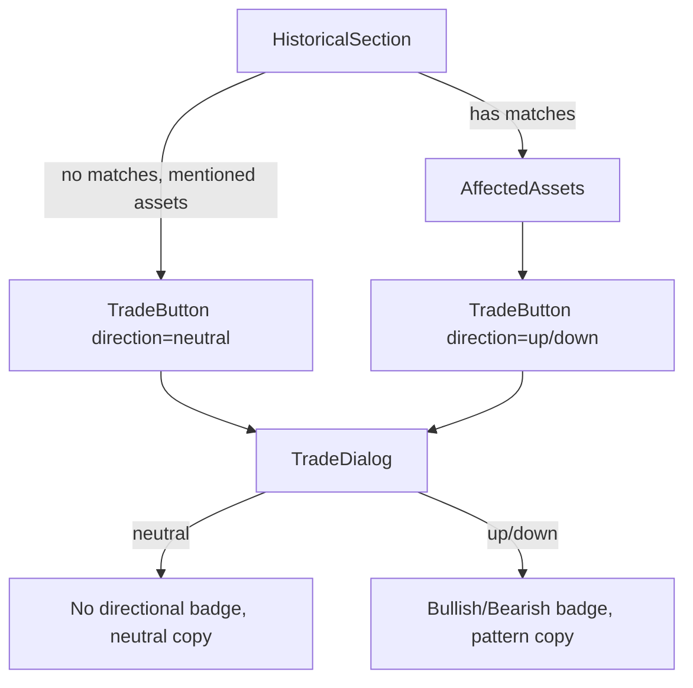

## Problem Statement

In `HistoricalSection.tsx`, when there are no historical matches but mentioned assets are extracted from the event title/summary, the `TradeButton` component receives a hardcoded `direction="up"` prop. This means the `TradeDialog` will show:

- "Buy (Bullish)" badge
- Text: "Based on historical patterns, this asset tends to move up after similar events."

But there are **NO historical patterns** — the page itself says "No historical parallels found yet." This creates a false bullish signal that could influence real trading decisions.

Observed on the UBS event detail page (`/event/live-global-1-2026-04-29`) where the "Mentioned Assets" fallback shows a UBS card with `direction="up"` hardcoded.

## User Story

As a trader viewing an event with no historical data, I want the Trade dialog to **not suggest a directional bias**, so that I don't make trading decisions based on a fabricated signal.

## How It Was Found

Browser testing: navigated to the UBS earnings event (today's event with no historical parallels). The "Mentioned Assets" section shows a Trade button. Inspected the code and confirmed `direction="up"` is hardcoded at line 146 of `HistoricalSection.tsx`:
```tsx
<TradeButton asset={asset} direction="up" />
```

## Proposed UX

When no historical data is available:
- The `TradeDialog` should show a **neutral** state: no Bullish/Bearish badge, and the description should say something like "No historical pattern data available for this event. Trade based on your own analysis."
- The direction prop should either accept a `null` / `"neutral"` value, or the `TradeButton` / `TradeDialog` should handle the no-data case gracefully.

Concretely:
1. Add `"neutral"` as a possible direction in `TradeDialog` and `TradeButton` props.
2. When direction is `"neutral"`, show a generic "Market Order" label instead of "Buy (Bullish)" / "Sell (Bearish)".
3. Change the description to: "No historical pattern data available. Trade based on your own analysis."
4. Default `isBuy` to `true` for neutral direction but make it clear there's no signal.
5. Update the `HistoricalSection` fallback to pass `direction="neutral"`.

## Acceptance Criteria

- [ ] Mentioned asset cards (no-history fallback) pass a neutral direction to `TradeButton`
- [ ] `TradeDialog` handles neutral direction: no "Bullish/Bearish" badge, neutral description text
- [ ] No false "Based on historical patterns" text when there are no patterns
- [ ] Events WITH historical data continue to show directional signals correctly
- [ ] All existing tests pass
- [ ] Verify in browser: open an event with no historical data, click Trade on a mentioned asset, confirm neutral dialog

## Verification

Run `npm test` to verify all tests pass. Open the app with `agent-browser`, navigate to an event with "No historical parallels found yet", click Trade on a mentioned asset, and screenshot the trade dialog to confirm neutral presentation.

## Out of Scope

- Changing how direction is calculated for events that DO have historical data
- Adding new asset extraction logic
- Changing the AffectedAssets component (which always has data)

---

## Planning

### Overview

The `HistoricalSection` component has a fallback path when no historical matches exist. It extracts mentioned asset names from the event title/summary and renders `TradeButton` with a hardcoded `direction="up"`. This falsely implies a bullish signal. The fix widens the `direction` type to include `"neutral"` and updates the `TradeDialog` to show non-directional copy when no pattern data exists.

### Research Notes

- `TradeButton` and `TradeDialog` currently accept `direction: "up" | "down"` — needs to accept `"neutral"`.
- `AffectedAssets` always receives data from historical matches so its `direction` will remain `"up" | "down"`.
- The `isBuy` variable in `TradeDialog` is derived from `direction === "up"`. For neutral, default to buy but make it clear there's no signal.
- Minimal blast radius: only `HistoricalSection.tsx`, `TradeDialog.tsx`, and `AffectedAssets.tsx` (type widening) are touched.

### Architecture Diagram



### One-Week Decision

**YES** — This is a small type-widening change across 3 files with straightforward UI copy changes. Completable in under a day.

### Implementation Plan

1. Widen the `direction` prop type in `TradeDialog` to `"up" | "down" | "neutral"`.
2. Update `TradeDialog` UI: when `direction === "neutral"`, show a gray "Market Order" badge instead of Bullish/Bearish, and replace the pattern-based description with "No historical pattern data available. Trade based on your own analysis."
3. Widen the `direction` prop type in `TradeButton` to match.
4. Update `HistoricalSection.tsx` fallback: change `direction="up"` to `direction="neutral"` on the mentioned assets `TradeButton`.
5. Update existing tests for `TradeDialog` and `HistoricalSection` to cover the neutral direction case.
6. Verify in browser.
