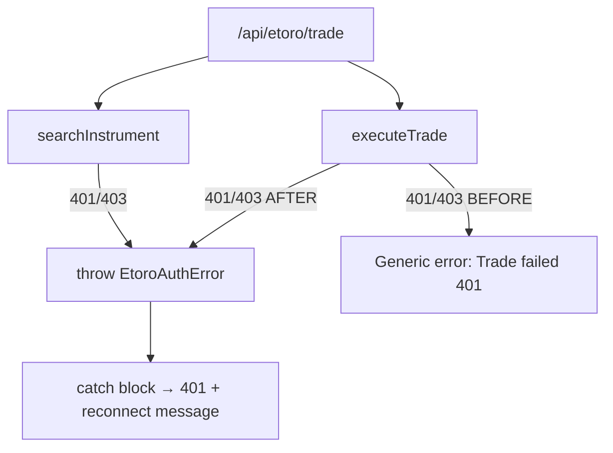

## Problem Statement

In `etoro-proxy.ts`, the `searchInstrument` function correctly throws `EtoroAuthError` when it receives a 401/403 response, allowing the trade API route to return a clear "eToro API keys are invalid — please reconnect" message. However, `executeTrade` does NOT detect auth errors — it returns a generic `{ success: false, error: "Trade failed (401)" }` for ALL non-OK responses, including authentication failures.

This means if a user's eToro API keys expire or are revoked mid-session:
- Instrument search succeeds (cached or keys still valid for that call)
- Trade execution fails with 401
- User sees "Trade failed (401)" instead of "eToro API keys are invalid — please reconnect"

The user has no idea their keys are the problem and may retry the trade repeatedly.

## User Story

As a trader whose eToro API keys have expired, I want to see a clear "please reconnect" message when my trade fails due to authentication, so that I know to re-enter my API keys instead of retrying a doomed trade.

## How It Was Found

Code review of `src/lib/etoro-proxy.ts`: `searchInstrument` (line 57) throws `EtoroAuthError` for 401/403, but `executeTrade` (line 110) catches all non-OK responses generically. The trade route handler (`src/app/api/etoro/trade/route.ts`) has a catch block for `EtoroAuthError` but it can only trigger from `searchInstrument`, never from `executeTrade`.

## Proposed Fix

In `executeTrade` (`src/lib/etoro-proxy.ts`), add the same auth error detection used in `searchInstrument`:

```ts
if (res.status === 401 || res.status === 403) throw new EtoroAuthError();
```

Add this check before the generic `!res.ok` handler. The existing catch block in the trade route handler already handles `EtoroAuthError` correctly, so no changes needed there.

## Acceptance Criteria

- [ ] `executeTrade` throws `EtoroAuthError` when eToro API returns 401 or 403
- [ ] The trade route handler returns the clear auth error message for trade execution auth failures
- [ ] Generic non-auth failures (400, 500, etc.) continue to return "Trade failed (status)" as before
- [ ] All existing tests pass
- [ ] Add a unit test that verifies `executeTrade` throws `EtoroAuthError` on 401 response

## Verification

Run `npm test` to verify all tests pass including the new test case.

## Out of Scope

- Changing the client-side UI for auth errors (already handled)
- Auto-reconnect flow
- Watchlist API auth error detection (already handled by the same pattern)

---

## Planning

### Overview

The `executeTrade` function in `etoro-proxy.ts` handles non-OK responses generically, returning `"Trade failed (status)"` for all failures including 401/403 auth errors. The `searchInstrument` function already throws `EtoroAuthError` for 401/403, and the trade route handler already catches `EtoroAuthError` — so the fix is simply adding the same auth detection to `executeTrade`.

### Research Notes

- `searchInstrument` (line 57): `if (res.status === 401 || res.status === 403) throw new EtoroAuthError();`
- `executeTrade` (line 110): generic `if (!res.ok)` handler — no auth detection.
- Trade route handler (line 89-95): catches `EtoroAuthError` and returns `{ error: error.message }` with 401 status.
- The watchlist route already handles auth errors through `searchInstrument` only.
- Existing test files: `src/lib/__tests__/etoro-proxy.test.ts` or similar may exist.

### Architecture Diagram



### One-Week Decision

**YES** — This is a 2-line code change plus a unit test. Completable in under an hour.

### Implementation Plan

1. In `executeTrade` in `src/lib/etoro-proxy.ts`, add auth error detection before the generic `!res.ok` handler:
   ```ts
   if (res.status === 401 || res.status === 403) throw new EtoroAuthError();
   ```
2. Add a unit test verifying `executeTrade` throws `EtoroAuthError` on 401 response.
3. Add a unit test verifying non-auth errors (e.g., 500) still return the generic error.
4. Run full test suite to verify no regressions.
