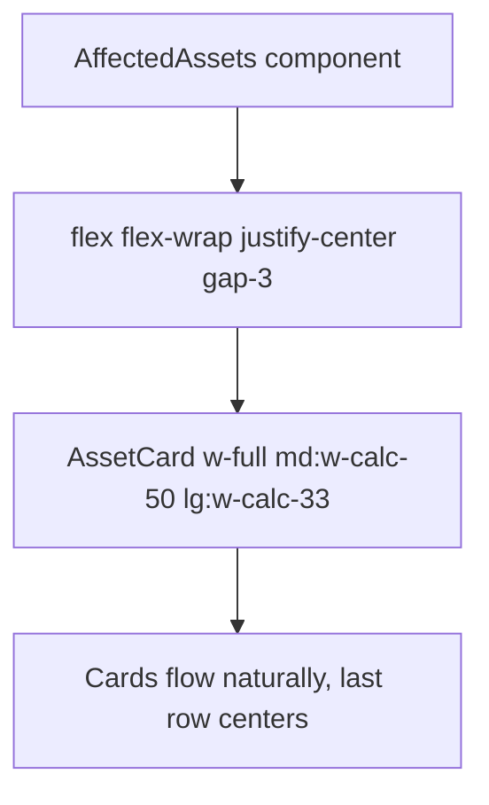

## Overview

Change the Affected Assets grid in `src/components/AffectedAssets.tsx` from CSS Grid to flexbox with `justify-center` so that the last row of cards centers when it has fewer items than the column count.

## Research Notes

- Current implementation uses `grid grid-cols-1 md:grid-cols-2 lg:grid-cols-3 gap-3` — CSS Grid always left-aligns items.
- Flexbox with `flex-wrap` and `justify-center` naturally centers incomplete rows.
- Each card needs a fixed width at each breakpoint to maintain the current sizing: `w-full md:w-[calc(50%-6px)] lg:w-[calc(33.333%-8px)]` (accounting for the gap).
- Alternative: keep Grid and use `justify-items-center` — but this centers ALL items including full rows, which misaligns them. Flexbox is the better approach.

## Architecture Diagram

## One-Week Decision

**YES** — This is a single CSS class change on one component. Takes ~30 minutes including tests.

## Implementation Plan

1. In `AffectedAssets.tsx`, replace the grid container classes with flex-based equivalents
2. Add responsive width classes to `AssetCard` wrapper
3. Update tests if any assert on grid classes
4. Verify in browser

## Problem Statement

In the Affected Assets grid on the event detail page, when the number of assets is not evenly divisible by the column count (e.g., 4 assets in a 3-column grid), the final card sits alone at the bottom-left of the grid. This creates visual asymmetry — the last row is left-aligned with two empty column slots on the right, making the layout look unfinished.

## User Story

As a trader viewing an event's affected assets, I want the asset cards to look balanced and professional regardless of how many there are, so the page feels polished rather than incomplete.

## How It Was Found

Observed via agent-browser on the event detail page for "Trump Tells Aides to Prepare for Extended Blockade of Iran" which shows 4 affected assets (Oil, Brent Crude, Gold, S&P 500). The first 3 cards fill the top row perfectly; the 4th card (S&P 500, bearish) sits alone at the bottom-left with empty space to its right. Screenshot evidence: review-screenshots/289-event-detail-bottom.png.

## Proposed UX

When the last row of the asset card grid has fewer items than the column count, center the remaining cards within the row. For example:
- 4 items in a 3-col grid: 3 cards on row 1, 1 card centered on row 2
- 5 items in a 3-col grid: 3 cards on row 1, 2 cards centered on row 2

Use CSS `justify-items: center` with flexbox wrapping, or use the `:last-child` / `:only-child` approach with auto margins. The cards should maintain their current width — only the horizontal position of the last row changes.

## Acceptance Criteria

- [ ] When Affected Assets has a non-3-divisible count (e.g. 4), the last row cards are horizontally centered
- [ ] When Affected Assets count is divisible by 3 (e.g. 3, 6), layout is unchanged
- [ ] Single asset card is centered
- [ ] Layout works correctly in both light and dark mode
- [ ] Layout works at all responsive breakpoints (1-col on mobile, 2-col on md, 3-col on lg)

## Verification

- Run all tests: `npm test`
- Open the event detail page for an event with 4 affected assets in agent-browser
- Screenshot the Affected Assets section and verify the last card is centered

## Out of Scope

- Changing the card width or height
- Changing the column count at different breakpoints
- Adding new asset cards or modifying card content
