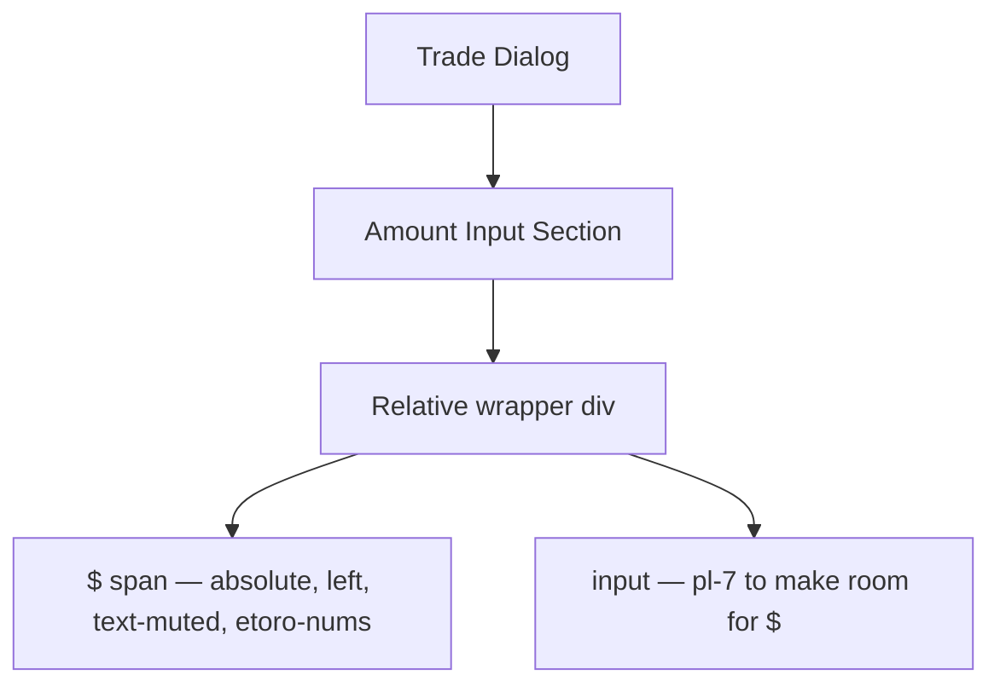

## Overview

Add an inline `$` prefix inside the trade amount input field in `src/components/TradeDialog.tsx`. Use a relative-positioned wrapper with an absolutely-positioned `$` span and left padding on the input.

## Research Notes

- The input currently uses `w-full h-10 px-3` with `etoro-nums` font class.
- Common pattern: wrap input in `relative` div, add `absolute left-3 top-1/2 -translate-y-1/2` span for the prefix, increase input `pl` to make room.
- The `$` should use `text-muted` color to distinguish from the editable value, and `etoro-nums` for font consistency.
- Need to ensure focus ring still applies correctly (it's on the input, not the wrapper).
- Error border styling also on the input — no changes needed there.

## Architecture Diagram

## One-Week Decision

**YES** — Single component change, ~20 minutes including test verification.

## Implementation Plan

1. In `TradeDialog.tsx`, wrap the amount input in a `relative` div
2. Add an absolutely-positioned `$` span inside the wrapper
3. Increase input left padding from `px-3` to `pl-7 pr-3`
4. Run existing tests to verify nothing breaks

## Problem Statement

The trade confirmation dialog's amount input is a bare number field with only a label "Amount (USD)" above it. Professional trading UIs (including eToro's own platform) always show the currency symbol inline with the input value, providing immediate context and reducing cognitive load. The current input looks generic and unfinished compared to production trading apps.

## User Story

As a trader entering an amount in the trade dialog, I want to see a dollar sign ($) directly in the input field, so I can immediately confirm I'm entering a USD value without reading the label above.

## How It Was Found

Observed via agent-browser when reviewing the trade confirmation dialog for visual polish. The amount input shows a plain number with no currency indicator inside the field. Compared against eToro's actual trading interface and Robinhood's trade entry, both of which show the currency symbol inline with the input value.

## Proposed UX

Add a non-interactive `$` prefix inside the amount input field, positioned to the left of the entered value. Implementation options:
1. Use a wrapper div with the `$` as a positioned element and add `pl-7` padding to the input
2. Use a flex container with a `$` span and the input side by side

The `$` should use the same font styling as the input value (etoro-nums) and be slightly muted in color to distinguish it from the editable value. It should not be selectable or editable.

## Acceptance Criteria

- [ ] Trade dialog amount input shows a `$` prefix inside the field, to the left of the entered value
- [ ] The `$` symbol uses consistent typography (etoro-nums font stretch)
- [ ] The `$` symbol is not editable or selectable
- [ ] Input field focus ring and validation error styling still work correctly
- [ ] The `$` is visible in both light and dark mode with appropriate contrast
- [ ] Existing tests still pass

## Verification

- Run all tests: `npm test`
- Open the trade dialog via agent-browser and verify the `$` prefix is visible
- Test with both valid and invalid amounts to verify error styling isn't broken

## Out of Scope

- Supporting other currencies
- Changing the amount validation logic
- Modifying the trade execution flow
