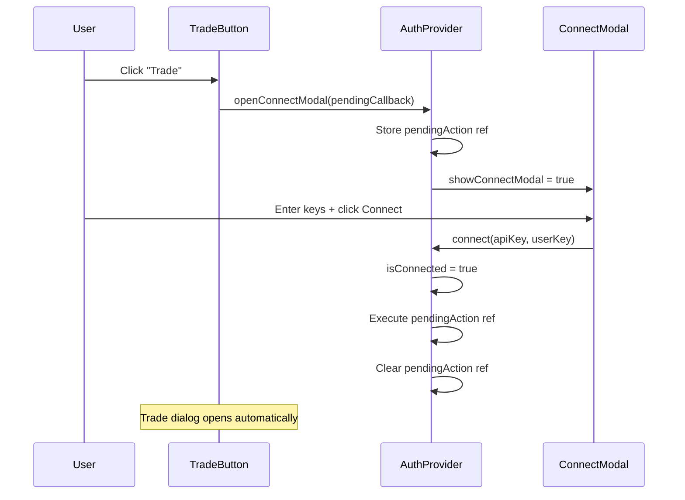

## Problem statement

When a user clicks "Trade" or the watchlist star while not connected to eToro, the Connect modal opens. After the user successfully enters their API keys and connects, the modal closes — but the original trade or watchlist intent is lost. The user must scroll back, find the same button, and click it again. This breaks the flow at the most critical conversion moment.

## User story

As a new user who just connected my eToro account, I want my pending Trade or Watchlist action to complete automatically after connecting, so that I don't have to re-find and re-click the button.

## How it was found

Observed during UX flow testing (iteration #48). Scenario: clicked "Trade Oil on eToro" while not connected → Connect modal opened → closed modal after hypothetical connect → returned to event detail page with no Trade dialog open → had to re-locate and re-click the Trade button.

## Proposed UX

1. When `TradeButton` or `WatchlistStar` calls `openConnectModal()`, also register a pending action callback in the AuthProvider context (e.g. `openConnectModal(() => setShowDialog(true))` for trade, or `openConnectModal(() => handleWatchlistAdd())` for watchlist).
2. After `connect()` succeeds in `AuthProvider`, if a pending action callback exists, execute it and clear it.
3. The pending action is cleared if the user manually closes the Connect modal without connecting.
4. No pending action is registered when the user clicks "Connect eToro" from the header (that's an intentional standalone action).

## Acceptance criteria

- [ ] Clicking "Trade" while not connected → Connect modal opens → after connecting, Trade dialog auto-opens for the same asset
- [ ] Clicking watchlist star while not connected → Connect modal opens → after connecting, watchlist API call fires automatically for the same asset
- [ ] Clicking "Connect eToro" from header → no pending action → modal closes normally after connect
- [ ] Closing the Connect modal without connecting clears any pending action
- [ ] All existing tests still pass

## Verification

Run `npm test` to verify all tests pass. Browse the app with agent-browser, click Trade on an asset while not connected, connect, and verify the Trade dialog opens automatically.

## Research notes

- `AuthProvider.tsx` already manages `openConnectModal` / `closeConnectModal` via context
- `TradeButton` (in `AffectedAssets.tsx`) calls `openConnectModal()` then returns — trade intent is lost
- `WatchlistStar` (in `AffectedAssets.tsx`) calls `openConnectModal()` then returns — watchlist intent is lost
- `LoginButton.tsx` calls `openConnectModal()` from the header without any pending action — this must remain unchanged
- `connect()` in AuthProvider sets `isConnected: true` and `showConnectModal: false` on success
- Solution: Add a `pendingAction` ref to AuthProvider, modify `openConnectModal` to accept an optional callback

## Architecture diagram

## One-week decision

**YES** — This is a focused state management change in AuthProvider and its two consumers (TradeButton, WatchlistStar). No new APIs, no new components, no infrastructure changes. Estimated: 1-2 hours.

## Implementation plan

1. **AuthProvider**: Add a `pendingActionRef` (useRef) to store an optional callback. Modify `openConnectModal` to accept `(callback?: () => void)`. In `connect()`, after success, call `pendingActionRef.current?.()` and clear it. In `closeConnectModal`, clear the ref.
2. **TradeButton**: Change `openConnectModal()` to `openConnectModal(() => setShowDialog(true))`.
3. **WatchlistStar**: Refactor `handleClick` so the watchlist API logic is in a separate function. Pass that function as the pending action: `openConnectModal(() => executeWatchlistAdd())`.
4. **LoginButton**: No changes — calls `openConnectModal()` without a callback (header connect).
5. **Tests**: Update AuthProvider tests if any mock `openConnectModal`. Add test verifying pending action execution after connect.

## Out of scope

- Persisting pending actions across page navigations
- Queueing multiple pending actions
