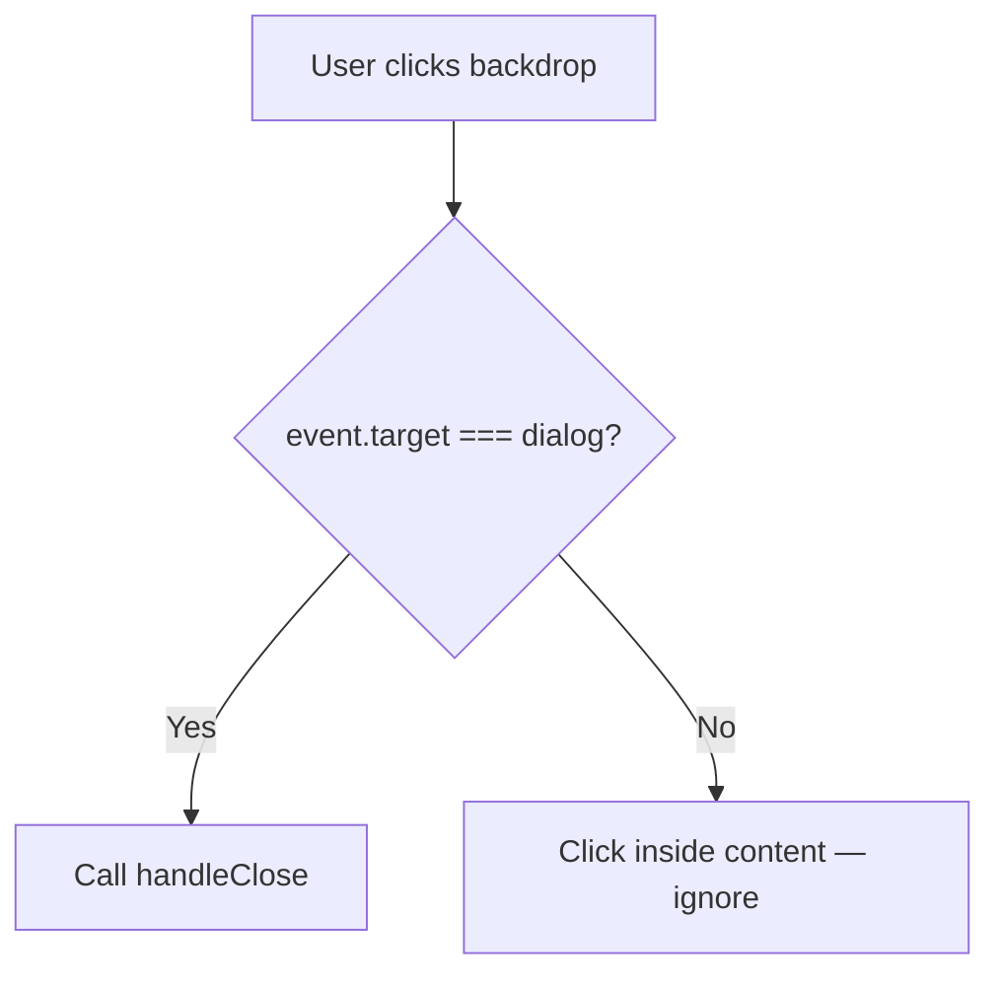

## Problem statement

Both the ConnectEtoroModal and TradeDialog use the native `<dialog>` element with `showModal()`. While pressing Escape dismisses them (native behavior), clicking the dimmed backdrop does nothing. Users commonly expect to dismiss modals by clicking outside them — this is a standard UX pattern across the web.

## User story

As a user viewing a modal dialog, I want to click outside the modal (on the dimmed backdrop) to dismiss it, so that I can quickly return to the content without finding the close button.

## How it was found

Observed during UX flow testing (iteration #48). Clicked "Trade Oil on eToro" → Connect modal opened → attempted to click the dimmed backdrop to close → nothing happened → had to locate and click the X button instead.

## Proposed UX

When the user clicks on the backdrop (the dimmed overlay), the modal closes. The standard technique for native `<dialog>` is to listen for clicks on the `<dialog>` element itself and check if the click target is the dialog (not its children). If so, close it.

## Acceptance criteria

- [ ] Clicking the backdrop of ConnectEtoroModal closes it
- [ ] Clicking the backdrop of TradeDialog closes it
- [ ] Clicking inside the modal content does NOT close it
- [ ] ESC key still closes both modals (existing behavior preserved)
- [ ] All existing tests still pass

## Verification

Run `npm test` to verify all tests pass. Browse the app, open both modals, and verify backdrop click dismisses them.

## Research notes

- Native `<dialog>` with `showModal()` does NOT close on backdrop click by default
- Standard technique: add `onClick` handler on `<dialog>` element, check if `event.target === dialogRef.current` — this means the click landed on the backdrop (the `<dialog>` element itself), not on its children
- Both `ConnectEtoroModal.tsx` and `TradeDialog.tsx` use `<dialog ref={dialogRef}>` with `showModal()`
- Both already have `handleClose` / `onClose` functions that properly clean up state
- The `::backdrop` pseudo-element is a child of the `<dialog>` in the top layer — clicks on it bubble to the `<dialog>` element

## Architecture diagram

## One-week decision

**YES** — Adding a single `onClick` handler to each of the 2 dialog elements. Estimated: 30 minutes.

## Implementation plan

1. **ConnectEtoroModal.tsx**: Add `onClick` handler to the `<dialog>` element that calls `handleClose()` when `event.target === dialogRef.current`.
2. **TradeDialog.tsx**: Add the same `onClick` handler that calls `handleClose()` when `event.target === dialogRef.current`.
3. **Tests**: Add test for each modal verifying backdrop click triggers close.

## Out of scope

- Adding backdrop click handling to any other dialogs that may exist in the future
- Animation on backdrop click dismiss
