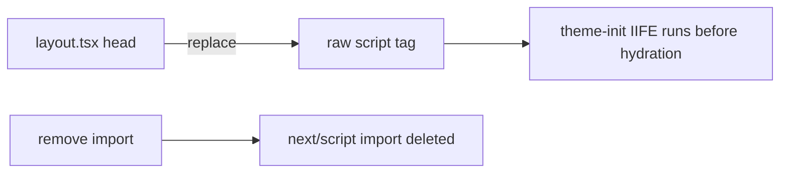

## Problem Statement

The root layout (`src/app/layout.tsx` line 41) uses `<Script>` from `next/script` with `strategy="beforeInteractive"` inside `<head>` to inject the theme initialization script. This triggers a React console error:

> "Encountered a script tag while rendering React component. Scripts inside React components are never executed when rendering on the client. Consider using template tag instead."

The error appears in the Next.js Dev Tools issues overlay (observed on the 404 event page). While the theme initialization still works, the console error indicates an incorrect API usage and contributes noise to the developer experience.

## How It Was Found

During surface-sweep review (iteration #50), navigating to a non-existent event URL (`/event/nonexistent-event-id`) showed the Next.js Dev Tools "2 Issues" badge. Opening the overlay revealed the console error pointing to `src/app/layout.tsx` line 41:9 inside `RootLayout`.

## User Story

As a developer, I want the console to be free of React warnings so that real errors stand out and the app uses the correct Next.js patterns.

## Proposed Fix

In Next.js App Router, inline scripts inside `<head>` should use a raw `<script>` tag with `dangerouslySetInnerHTML` instead of the `next/script` `<Script>` component. The `<Script>` component is designed for `<body>` placement; inside `<head>`, a raw `<script>` tag achieves the same result without the React warning.

Replace:
```tsx
<Script id="theme-init" strategy="beforeInteractive" dangerouslySetInnerHTML={{ __html: THEME_INIT }} />
```

With:
```tsx
<script dangerouslySetInnerHTML={{ __html: THEME_INIT }} />
```

Also remove the unused `import Script from "next/script"` if no other usages remain.

## Acceptance Criteria

- [ ] No "Encountered a script tag" console error on any page
- [ ] Theme initialization still works (dark mode persists across page loads)
- [ ] `npm run build` passes
- [ ] All tests pass
- [ ] The `import Script from "next/script"` import is removed if unused

## Verification

1. Run `npm run build` and `npm test`
2. Open the app in the browser, toggle dark mode, refresh — theme should persist
3. Check Next.js Dev Tools for any remaining console errors

## Out of Scope

- Changing theme initialization logic
- Fixing the `performance.measure` error (Next.js internal issue)

## Planning

### Overview

Replace the `next/script` `<Script>` component inside `<head>` with a raw `<script>` tag. In Next.js App Router, `<head>` contents are rendered as part of the React component tree. React 19 warns when script tags appear inside component trees because client-rendered scripts are never executed. The `next/script` component with `strategy="beforeInteractive"` renders a `<script>` element, triggering this warning. A raw `<script>` tag with `dangerouslySetInnerHTML` inside `<head>` is the correct pattern — Next.js serializes it into the HTML response before hydration.

### Research Notes

- React 19 added a console warning for `<script>` tags rendered inside component trees (they're never re-executed on the client)
- Next.js App Router `<head>` is part of the component tree, unlike Pages Router where `<Head>` from `next/head` was handled specially
- The `next/script` component is designed for `<body>` placement; inside `<head>`, it becomes a plain `<script>` tag which triggers the warning
- Using a raw `<script>` tag inside `<head>` is the documented pattern for blocking inline scripts in App Router
- The `import Script from "next/script"` should be removed since there are no other usages in layout.tsx

### Architecture Diagram



### One-Week Decision

**YES** — this is a 2-line change: swap the `<Script>` for `<script>` and remove the unused import. Estimated effort: 5 minutes.

### Implementation Plan

1. In `src/app/layout.tsx`, replace line 41's `<Script id="theme-init" strategy="beforeInteractive" dangerouslySetInnerHTML={{ __html: THEME_INIT }} />` with `<script dangerouslySetInnerHTML={{ __html: THEME_INIT }} />`
2. Remove `import Script from "next/script"` from line 4
3. Verify `npm run build` passes and `npm test` passes
4. Verify in browser that theme initialization still works and no console errors remain
