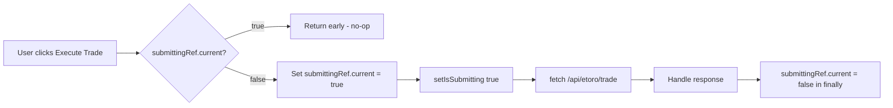

## Problem statement

The `TradeDialog.handleTrade` function uses React state (`isSubmitting`) to prevent double submission, but there is no synchronous guard. Between two rapid clicks, both `handleTrade` invocations can start executing before React re-renders to disable the button. This could result in a duplicate trade being submitted to the eToro API.

The `WatchlistStar` component already solves this problem correctly using a `useRef(false)` synchronous guard (`inFlightRef`). The `TradeDialog` should use the same pattern.

## User story

As a trader, I want the "Execute Trade" button to be immune to rapid double-clicks, so that I don't accidentally execute the same trade twice and lose money.

## How it was found

Code inspection during edge-case review. The `WatchlistStar` component in `AffectedAssets.tsx` (line 89–93) uses `inFlightRef.current` as a synchronous guard before setting state and making the API call. The `TradeDialog.handleTrade` (line 39–74) relies only on `setIsSubmitting(true)` which is asynchronous — React batches state updates, so a second click can fire before the re-render disables the button.

## Proposed UX

No visual change. The fix is invisible — the second click simply does nothing. The existing loading spinner and disabled state remain as they are.

## Acceptance criteria

- [ ] Add a `useRef(false)` guard (`submittingRef`) in `TradeDialog`
- [ ] At the top of `handleTrade`, return early if `submittingRef.current` is `true`
- [ ] Set `submittingRef.current = true` before the fetch, reset to `false` in `finally`
- [ ] Existing tests still pass
- [ ] Add a test that calls `handleTrade` twice rapidly and asserts only one fetch is made

## Verification

- Run `npx vitest run` — all tests pass
- Open the app, navigate to an event detail, verify trade dialog still works correctly

## Out of scope

- Server-side idempotency (request deduplication)
- Any visual changes to the trade dialog

---

## Planning

### Research notes

- React 18 batches state updates inside event handlers. Two synchronous `onClick` calls cannot interleave, but the button re-render (which reads the new `isSubmitting` value to apply `disabled`) only happens AFTER the handler returns.
- A rapid double-click dispatches two separate `click` events. The first handler sets `isSubmitting(true)` but React hasn't re-rendered yet, so the second handler runs with the old closure where `isSubmitting` is still `false`.
- The `WatchlistStar` component (`src/components/AffectedAssets.tsx`) already has the correct pattern using `const inFlightRef = useRef(false)` — checked synchronously at function entry.
- No external dependencies needed.

### Architecture diagram

### One-week decision

**YES** — This is a ~15-minute change. Add one ref, one guard check, one reset in finally. Plus a test.

### Implementation plan

1. In `TradeDialog.tsx`:
   - Add `const submittingRef = useRef(false);`
   - At top of `handleTrade`: `if (submittingRef.current) return;`
   - Before the demo warning check: `submittingRef.current = true;` (actually after the warning check, before the fetch)
   - In the `finally` block: `submittingRef.current = false;`
2. In `TradeDialog.test.tsx`:
   - Add a test that mounts the dialog, fires two rapid clicks on the execute button, and asserts `fetch` was called exactly once.
