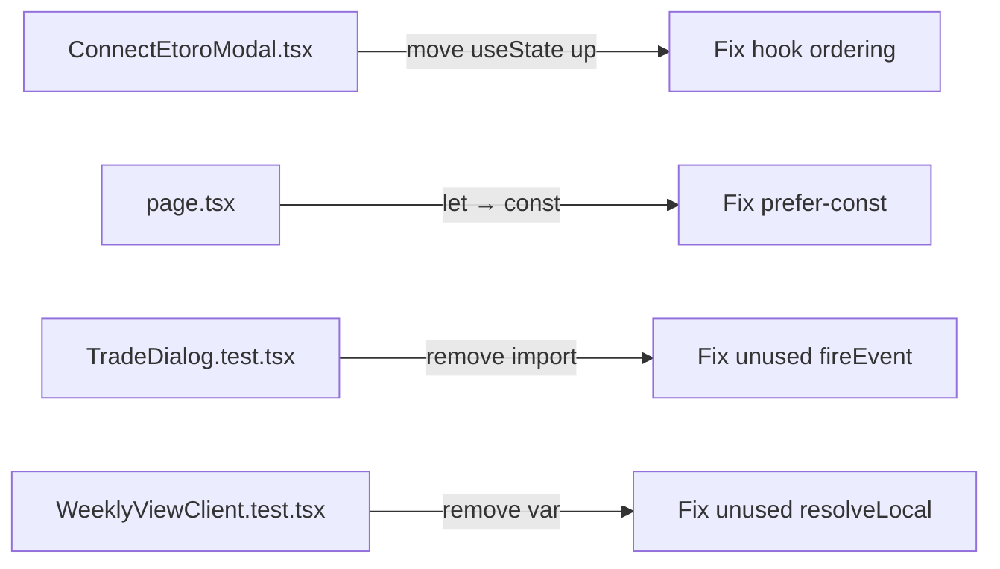

## Problem Statement

Running `npx eslint src/` produces 2 errors and 2 warnings:

1. **ConnectEtoroModal.tsx:19** — `setWarning` is accessed before it is declared (`react-hooks/immutability`). The `useState` for `warning` is on line 35, but `setWarning` is used inside `handleClose` on line 19. Moving the hook declaration up with the other `useState` calls (lines 8–11) fixes the ordering.

2. **event/[id]/page.tsx:92** — `event` is declared with `let` but never reassigned after initial assignment (`prefer-const`). Refactor to use `const` directly.

3. **TradeDialog.test.tsx:2** — Unused import `fireEvent` (`@typescript-eslint/no-unused-vars`).

4. **WeeklyViewClient.test.tsx:387** — Unused variable `resolveLocal` (`@typescript-eslint/no-unused-vars`).

## How It Was Found

During surface-sweep review (iteration #52), `npx eslint src/` returned 4 problems (2 errors, 2 warnings).

## User Story

As a developer, I want zero ESLint errors in the codebase so that CI passes cleanly and potential bugs (like the hook ordering issue) are caught early.

## Proposed Fix

1. **ConnectEtoroModal.tsx** — Move `const [warning, setWarning] = useState("")` from line 35 up to line 11 (after the other `useState` declarations).

2. **event/[id]/page.tsx** — Replace the `let event` / `event = eventResult` pattern with direct `const` assignment after `Promise.all`.

3. **TradeDialog.test.tsx** — Remove unused `fireEvent` from the import.

4. **WeeklyViewClient.test.tsx** — Remove unused `resolveLocal` variable.

## Acceptance Criteria

- [ ] `npx eslint src/` exits with 0 errors and 0 warnings
- [ ] `npm run build` passes
- [ ] All tests pass
- [ ] ConnectEtoroModal close flow still clears all form state

## Verification

1. Run `npx eslint src/` — should report 0 problems
2. Run `npm run build` — should pass
3. Run `npx vitest run` — all tests should pass

## Out of Scope

- Refactoring beyond what's needed to fix the lint errors
- Adding new lint rules

## Planning

### Overview

Fix 4 ESLint problems (2 errors, 2 warnings) across 4 files. The most significant is a React hook ordering issue in `ConnectEtoroModal.tsx` where `setWarning` is used inside a `useCallback` declared before the `useState` that creates it. While this works at runtime (the callback captures the variable by closure and is only invoked after all hooks have run), it violates the `react-hooks/immutability` rule and is a code smell.

### Research Notes

- React hooks must be called in the same order on every render, but the order of hooks relative to callbacks using their setters doesn't matter at runtime — callbacks form closures over the function scope
- The ESLint rule `react-hooks/immutability` enforces that hook state setters are not referenced before their declaration to prevent temporal dead zone issues
- The `prefer-const` rule flags variables declared with `let` that are only assigned once

### Architecture Diagram

### One-Week Decision

**YES** — This is a 10-minute fix across 4 files. Each change is 1–3 lines. Estimated effort: under 15 minutes including test verification.

### Implementation Plan

1. `ConnectEtoroModal.tsx`: Move `const [warning, setWarning] = useState("")` from line 35 to line 11 (after `const [isSubmitting, setIsSubmitting] = useState(false)`)
2. `event/[id]/page.tsx`: Remove `let event` declaration on line 79, change line 92 to `const event = eventResult`, keep `prev` and `next` as `const` directly assigned from `adjacentResult`
3. `TradeDialog.test.tsx`: Remove `fireEvent` from the import on line 2
4. `WeeklyViewClient.test.tsx`: Remove the unused `resolveLocal` variable around line 387
5. Run `npx eslint src/` to confirm 0 problems
6. Run `npx vitest run` to confirm all tests pass
7. Run `npm run build` to confirm clean build
