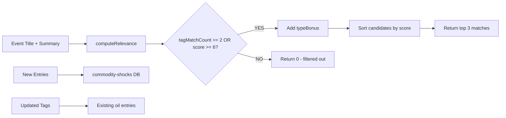

## Problem statement

The headline "Jet fuel bidding war breaks out as airlines confront global stress test" returns "No historical parallels found yet." This is a commodity-shock event but the historical database contains zero entries about airline fuel crises, jet fuel supply disruptions, or aviation industry commodity shocks. Additionally, the keyword matcher does not try to match "airline", "jet fuel", "aviation", "flight" to commodity-shock entries, and existing oil entries lack airline-related tags.

## User story

As a trader reading about an airline fuel crisis, I want to see how similar events affected airline stocks and oil prices historically, so that I can make an informed trading decision.

## How it was found

Direct user feedback from the product owner — CRITICAL priority. The user encountered "No historical parallels found yet" when viewing a jet fuel/airline stress test article, which is the worst possible UX for the core feature.

## Proposed UX

When viewing any article about jet fuel, airline fuel costs, aviation disruptions, or similar commodity shocks affecting airlines, the historical section should display 1-3 relevant historical parallels with market reaction data (e.g. 2008 oil spike, 2022 post-COVID jet fuel shortage).

## Acceptance criteria

- [ ] Add 5 new historical entries to `historical-db.ts` under `commodity-shocks`:
  1. 2022 Post-COVID jet fuel shortage
  2. 2008 oil spike to $147/barrel
  3. 1990 Gulf War oil shock
  4. 2010 Eyjafjallajökull volcano aviation disruption
  5. 2023 Jet fuel crack spread spike
- [ ] Each entry has tags including: jet fuel, airline, aviation, flight, and event-specific tags
- [ ] Add broader tags to existing oil-related entries: "airline", "aviation", "fuel cost"
- [ ] `findHistoricalMatches` returns results for "Jet fuel bidding war breaks out as airlines confront global stress test" with type "commodity-shocks"
- [ ] Add test cases verifying airline/jet fuel queries match the new entries
- [ ] All existing tests still pass

## Verification

- Run `npm test` and confirm all tests pass including new tests
- Browse the app and find a commodity-shock event to verify historical matches display

## Out of scope

- Changing the matching algorithm fundamentally
- Adding entries for other missing categories

## Planning

### Overview

Add 5 new historical entries to the commodity-shocks category in `src/lib/historical-db.ts` covering airline/jet fuel events. Also add aviation-related tags to existing oil entries so they cross-match on airline-themed queries. Add tests to ensure matching works for jet fuel/airline queries.

### Research notes

- `src/lib/historical-db.ts` — single-file historical DB with entries grouped by EventType
- Matching uses `computeRelevance()` which scores tag matches (specificity-weighted) + word overlap
- Threshold: `tagMatchCount < 2 && score < 6` → returns 0 (filters out weak matches)
- TypeBonus of 4 is added AFTER relevance check, so it only helps entries that already pass the threshold
- Existing commodity-shocks entries: oil negative price, OPEC cuts, natural gas Europe, gold ATH — no airline entries
- Existing oil entries have tags like "oil", "crude", "barrel" but NOT "airline", "aviation", "fuel cost"
- The query "Jet fuel bidding war breaks out as airlines confront global stress test" would match 0 entries currently because no tags contain "jet fuel", "airline", "aviation", or "flight"

### Assumptions

- The 5 requested entries have historically accurate market reaction data (approximate based on public records)
- Adding "airline", "aviation", "fuel cost" tags to existing oil entries is safe and won't cause false positive matches on non-aviation events

### Architecture diagram

### One-week decision

**YES** — This is a data-entry + minor code change task. All changes are in one file (`historical-db.ts`) plus one test file. No architecture changes needed. Estimated: ~1 hour.

### Implementation plan

1. Add 5 new HistoricalEntry objects to `DB["commodity-shocks"]` with accurate descriptions, years, whySimilar, insight, reactions, and aviation-specific tags
2. Add "airline", "aviation", "fuel cost" tags to existing commodity-shocks oil entries (oil negative price, OPEC cuts)
3. Add "airline", "aviation", "fuel cost" tags to existing geopolitical oil entries (Russia-Ukraine, Iran Hormuz)
4. Add test cases in `historical-db.test.ts`:
   - "Jet fuel bidding war breaks out as airlines confront global stress test" with type "commodity-shocks" returns matches
   - "Airlines face rising fuel costs as oil prices surge" returns matches
5. Run full test suite to verify no regressions
