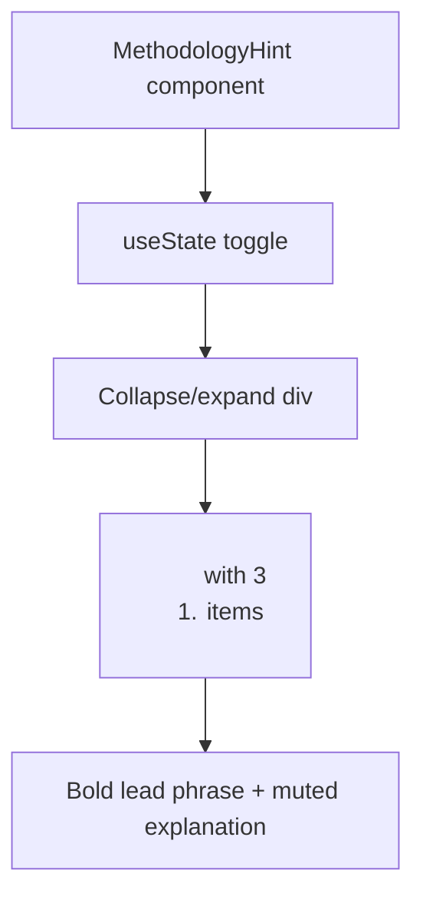

## Problem statement

The "How does this work?" expandable section in `WeeklyViewClient.tsx` (`MethodologyHint` component) currently shows a single dense paragraph when expanded:

> "We aggregate headlines from major financial outlets, identify the most market-moving event each day, and use historical pattern matching to find similar past events. Market reaction data shows how affected assets performed after each historical parallel."

This is the primary onboarding touchpoint for first-time users who don't understand the product. The plain text paragraph is hard to scan and doesn't convey the 3-step value proposition clearly. Additionally, the `maxHeight` is hardcoded at `120px`, which clips on some viewports.

The same text is repeated verbatim in the footer's "HOW IT WORKS" section, making the expandable version feel redundant rather than helpful.

## User story

As a first-time visitor, I want to quickly understand how the app works within a few seconds so that I can decide whether to explore further.

## How it was found

Fresh-eyes browser review of the landing page. Clicked "How does this work?" and observed a wall of text that's identical to the footer content. Not scannable — requires reading the entire paragraph to grasp the concept.

## Proposed UX

Replace the paragraph with 3 clear numbered steps:

1. **We scan the news** — Headlines from Reuters, CNBC, Google News and more
2. **Match to history** — Find similar past events using pattern matching
3. **Show the market reaction** — See how affected assets moved after each parallel

Each step should be a short line with a bold lead phrase. Use the existing `text-muted` and `text-[12px]` style but with `font-medium` on the lead phrases. Use an `<ol>` for semantic structure.

Remove the hardcoded `maxHeight: 120px` — use `auto` with proper transition or increase to accommodate the new format.

Keep the footer "HOW IT WORKS" paragraph as-is (it serves as a longer-form explanation for visitors who scroll to the bottom).

## Acceptance criteria

- [ ] "How does this work?" expands to show 3 clearly separated numbered steps
- [ ] Each step has a bold lead phrase followed by a brief explanation
- [ ] Content is fully visible without clipping on both mobile and desktop
- [ ] Footer "HOW IT WORKS" section remains unchanged
- [ ] Dark mode renders correctly
- [ ] Collapse/expand animation still works smoothly

## Verification

- Run all tests and confirm they pass
- Verify in browser with agent-browser: expand the section on landing page, screenshot in both light and dark mode

## Out of scope

- Adding icons or illustrations to the steps
- Changing the footer HOW IT WORKS section
- Modifying the "How does this work?" button text or position

---

## Planning

### Overview

Small UI-only change in the `MethodologyHint` component within `src/components/WeeklyViewClient.tsx` (lines 65–88). Replace the single `
` paragraph with a styled `<ol>` containing 3 list items. Fix the hardcoded `maxHeight: 120px` to accommodate the new taller content.

### Research notes

- Component is a simple toggle using `useState` — no external dependencies
- The `maxHeight` transition pattern requires a value large enough for expanded content; using `200px` will suffice for 3 short lines
- Existing CSS classes (`text-muted`, `text-[12px]`) are already used — adding `font-medium` for lead phrases is consistent with the project's Tailwind usage
- No tests specifically target the paragraph text; existing tests should pass unchanged

### Assumptions

- The 3-step wording proposed in the PRD is final
- No icons needed (out of scope per PRD)

### Architecture diagram

### One-week decision

**YES** — This is a ~15-minute change to one component. Replace a `
` with an `<ol>`, adjust `maxHeight`, done.

### Implementation plan

1. In `MethodologyHint`, replace the `
` with an `<ol>` containing 3 `<li>` items
2. Each `<li>`: bold lead phrase (`font-medium text-foreground/80`) + dash + muted explanation
3. Change `maxHeight` from `120px` to `200px` to prevent clipping
4. Verify in browser: light mode, dark mode, expanded, collapsed
5. Run tests
