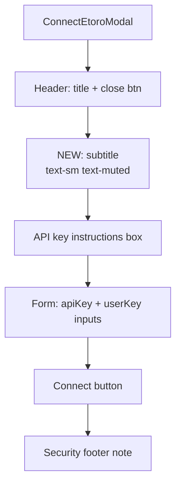

## Problem statement

The Connect eToro modal (`ConnectEtoroModal.tsx`) opens with the title "Connect to eToro" and immediately shows API key instructions. There is no explanation of *why* a user should connect — what capabilities it unlocks.

A first-time user who clicks "Connect eToro" in the header hasn't yet explored the app enough to know that connecting enables one-click trading from event analysis and watchlist management via eToro API. Without this context, the modal feels like a configuration burden rather than a value-add.

## User story

As a first-time user, I want to understand what connecting my eToro account enables so that I'm motivated to complete the connection process.

## How it was found

Fresh-eyes browser review. Opened the Connect eToro modal from the header button and observed no explanation of what connecting enables — just API key form fields with instructions on how to get keys.

## Proposed UX

Add a brief subtitle below the "Connect to eToro" title:

**"Trade directly from event analysis and manage your eToro watchlist."**

Style: `text-sm text-muted` — a single line of muted text below the title, before the API key instructions section.

This gives first-time users immediate context about the value of connecting without adding visual clutter.

## Acceptance criteria

- [ ] A subtitle line appears below the "Connect to eToro" heading in the modal
- [ ] The subtitle explains what connecting enables (trading + watchlist)
- [ ] Style uses `text-sm text-muted` consistent with the modal's existing design
- [ ] Dark mode renders correctly
- [ ] Modal still fits within viewport without scrolling on mobile (375px)
- [ ] Existing tests pass

## Verification

- Run all tests and confirm they pass
- Verify in browser: open Connect eToro modal, confirm subtitle appears in both light and dark mode

## Out of scope

- Changing the modal layout or structure
- Adding icons or illustrations
- Changing the header "Connect eToro" button text

---

## Planning

### Overview

Add a single line of subtitle text below the "Connect to eToro" heading in `src/components/ConnectEtoroModal.tsx` (line 62). No structural changes, no new dependencies.

### Research notes

- The modal header is at line 61–72: a flex row with the h2 title and close button
- Adding a `
` after the header div, before the API key instructions div, is the cleanest placement
- Existing style patterns: `text-sm text-muted` is used elsewhere in the modal (e.g., the footer security note uses `text-[11px] text-muted/60`)
- The test file `ConnectEtoroModal.test.tsx` renders the modal and checks for specific elements — adding a subtitle won't break existing assertions

### Assumptions

- Subtitle text: "Trade directly from event analysis and manage your eToro watchlist."
- No localization needed

### Architecture diagram

### One-week decision

**YES** — This is a ~5-minute change: add one `
` tag with a subtitle string.

### Implementation plan

1. Add a `
` after the header `
` (line 72)
2. Text: "Trade directly from event analysis and manage your eToro watchlist."
3. Run tests to confirm nothing breaks
4. Verify in browser: light mode, dark mode, mobile viewport
