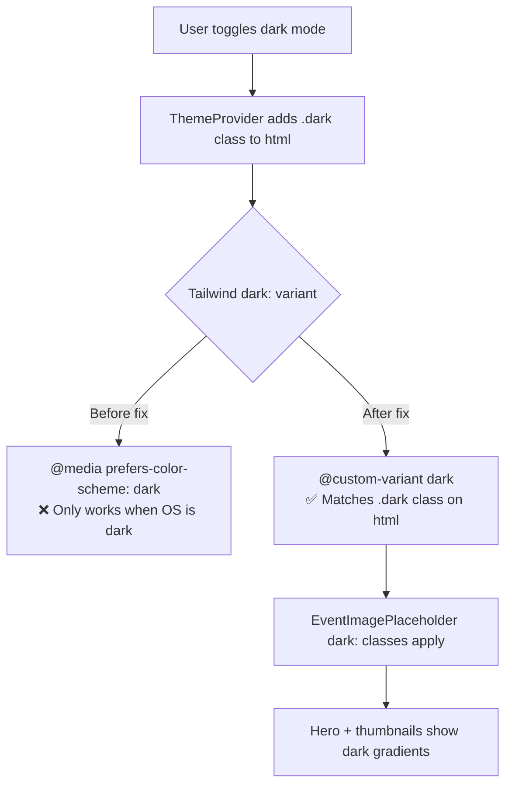

## Problem statement

The app uses class-based dark mode (`.dark` class on `<html>`) but Tailwind v4 defaults its `dark:` variant to `@media (prefers-color-scheme: dark)`. As a result, any component using Tailwind `dark:` utility classes will only respond to the OS dark mode preference, not the in-app toggle.

Currently, `EventImagePlaceholder.tsx` is the only component using Tailwind `dark:` classes directly (both `PLACEHOLDER_COLORS` and `HERO_COLORS` maps include `dark:from-*` and `dark:to-*` variants). When a user toggles to dark mode but their OS is in light mode, the event hero placeholder and event card thumbnails display light-colored backgrounds against the dark UI — a jarring visual glitch.

## User story

As a user who toggles dark mode in the app while my OS is in light mode, I want the event image placeholders to match the dark theme so the UI feels consistent and polished.

## How it was found

Edge-case testing: toggled app to dark mode on a machine with OS light mode. Browser evaluation confirmed `document.documentElement.classList.contains("dark") === true` but `window.matchMedia("(prefers-color-scheme: dark)").matches === false`. Screenshots 389, 395, 396 show the light-colored hero placeholder on a dark background.

## Proposed fix

Add a Tailwind v4 custom variant override in `src/app/globals.css` so `dark:` utilities use the class-based selector:

```css
@custom-variant dark (&:where(.dark, .dark *));
```

This single line, placed after `@import "tailwindcss";`, makes all `dark:` utilities respond to the `.dark` class instead of the OS media query.

## Acceptance criteria

- [ ] `dark:` Tailwind utilities apply when `.dark` class is on `<html>`, regardless of OS preference
- [ ] Event hero placeholder shows dark gradient colors in dark mode (verified via screenshot)
- [ ] Event card thumbnails show dark gradient colors in dark mode
- [ ] Light mode still works correctly (no `dark:` leakage)
- [ ] All existing tests pass
- [ ] Build succeeds with no new warnings

## Verification

1. Run `npm test` — all tests pass
2. Run `npm run build` — no errors
3. Open app, toggle dark mode on (OS in light mode), navigate to any event detail — hero placeholder should show dark-toned gradient
4. Toggle back to light mode — hero placeholder should show light-toned gradient

## Out of scope

- Refactoring EventImagePlaceholder to use CSS custom properties instead of Tailwind dark: classes
- Adding dark mode variants to other components (they already use CSS custom properties)

---

## Planning

### Overview

Single-line CSS fix: add `@custom-variant dark` directive to `globals.css` so Tailwind v4's `dark:` utilities respect the `.dark` class on `<html>` instead of the `prefers-color-scheme` media query.

### Research notes

- Tailwind v4 uses `@media (prefers-color-scheme: dark)` for `dark:` by default
- The `@custom-variant` directive overrides this behavior
- Correct syntax: `@custom-variant dark (&:where(.dark, .dark *));`
- Must be placed after `@import "tailwindcss";` but before any rules
- Only `EventImagePlaceholder.tsx` uses Tailwind `dark:` classes; all other dark mode styling uses CSS custom properties under `.dark {}`

### Assumptions

- The `.dark` class approach is intentional and should remain (not switching to `prefers-color-scheme`)
- No other files need changes — the `@custom-variant` directive fixes all `dark:` utilities globally

### Architecture diagram



### One-week decision

**YES** — This is a one-line CSS change. Implementation + testing takes under 30 minutes.

### Implementation plan

1. Add `@custom-variant dark (&:where(.dark, .dark *));` to `src/app/globals.css` after the `@import "tailwindcss";` line
2. Run `npm run build` to verify no errors
3. Run `npm test` to verify no regressions
4. Visual verification: dark mode hero placeholder should show dark gradient colors
