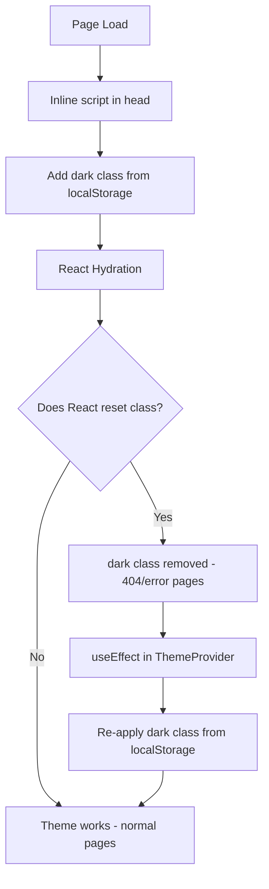

## Problem statement

When a user has dark mode enabled (localStorage `theme=dark`) and navigates to a 404 page (e.g., `/event/live-global-99-2026-04-15` or `/totally-random-url`), the page renders in light mode. The `dark` class is NOT on the `<html>` element despite the theme init script being present in `<head>` and localStorage correctly containing `theme=dark`.

Confirmed sequence:
1. Home page shows `h-full dark` on `<html>` — dark mode works
2. Navigate to invalid URL (full page navigation)
3. 404 page `<html>` has only `h-full` — `dark` class is missing
4. `localStorage.getItem('theme')` returns `"dark"` on the 404 page
5. The inline theme init script IS present in `<head>`

Root cause: React hydration resets the `<html>` class to match the server-rendered `className="h-full"`, removing the `dark` class that the inline script added. The ThemeProvider only *reads* the theme from the DOM (via `useSyncExternalStore`) — it never *writes* it after hydration, so there's nothing to re-add the `dark` class after React removes it.

## User story

As a user who prefers dark mode, I want 404 and error pages to respect my theme selection, so that I don't see a jarring white flash when I hit an invalid URL.

## How it was found

During error-handling review, navigated to invalid event URLs in dark mode. Observed that the 404 page renders in light mode while the home page correctly shows dark mode. Confirmed via `document.documentElement.classList.toString()` returning `"h-full"` (missing `dark`) on the 404 page vs `"h-full dark"` on the home page.

Screenshots: review-screenshots/392-404-dark-mode.png, review-screenshots/393-home-dark.png, review-screenshots/394-404-dark-confirmed.png

## Proposed UX

The 404 page, error pages (`error.tsx`, `event/[id]/error.tsx`), and global error page should all render in the user's selected theme — dark or light. No visual difference from any other page.

## Acceptance criteria

- [ ] Navigating to a 404 page in dark mode renders with dark theme
- [ ] Navigating to a 404 page in light mode renders with light theme
- [ ] The `dark` class persists on `<html>` after hydration on all pages including not-found
- [ ] Error boundary pages (`error.tsx`) also respect dark mode
- [ ] No flash of wrong theme (FOIT) on any page

## Verification

- Run all tests
- In browser with dark mode enabled, navigate to `/event/nonexistent-id` and verify the page has a dark background
- Check `document.documentElement.classList` includes `dark`
- Toggle to light mode, navigate to another 404 URL, verify light theme

## Out of scope

- Changing the overall theme architecture
- Changing the inline theme init script approach
- Adding theme persistence beyond localStorage

## Planning

### Overview

The ThemeProvider uses `useSyncExternalStore` to read the theme from the DOM (whether `dark` class is on `<html>`) but never writes it. The inline `<script>` in `<head>` adds the `dark` class before React hydration, but React hydration resets the `<html>` class to match the server-rendered `className="h-full"`, removing `dark`. On normal pages this doesn't happen (likely due to Suspense boundaries deferring hydration), but on the 404 page the simpler component tree causes React to eagerly reconcile the `<html>` element.

### Research notes

- `suppressHydrationWarning` only suppresses the console warning — it does NOT prevent React from "fixing" attribute mismatches during hydration
- The standard fix for this pattern is to add a `useEffect` in the ThemeProvider that re-applies the class from localStorage after mount/hydration
- The existing theme init script should remain (it prevents FOUC for normal pages), but we need a safety net after hydration

### Assumptions

- The issue only manifests on pages where React eagerly hydrates the full tree (404, error pages)
- The fix should not cause any visible flicker on pages where the theme init script already works

### Architecture diagram

### One-week decision

**YES** — This is a single-file change to `ThemeProvider.tsx`. Add a `useEffect` that reads `localStorage.getItem('theme')` after mount and ensures the `dark` class is set/removed accordingly. ~30 minutes of work.

### Implementation plan

1. In `ThemeProvider.tsx`, add a `useEffect` (runs once after mount) that reads `localStorage.getItem('theme')` and sets/removes the `dark` class on `<html>` to match
2. This acts as a safety net: if the inline script's class was removed during hydration, the `useEffect` re-adds it
3. Update existing ThemeProvider tests to cover the hydration recovery scenario
4. Verify in browser on 404 page with dark mode enabled
