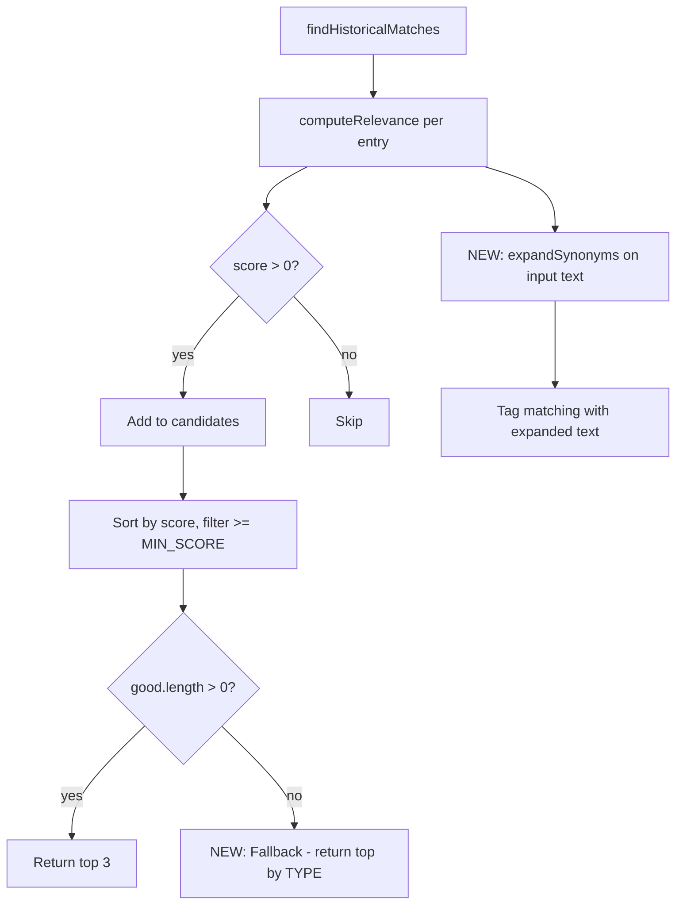

## Problem Statement

Three critical issues in the historical matching engine (`src/lib/historical-db.ts`):

1. **BOJ matching fails**: "BOJ keeps interest rates steady, lifts inflation forecast" returns zero matches despite 3 BOJ entries in the DB. Root cause: the title says "BOJ" (acronym) but tags include "bank of japan" and "japan" — the matcher requires literal substring match so "BOJ" only matches the "boj" tag (1 match). The early-exit condition `tagMatchCount < 2 && score < 6` then kills the candidate.

2. **No emerging market central bank entries**: No entries exist for Turkey, Argentina, or Brazil central banks. "Turkish central bank keeps key policy rate unchanged again" has zero possible matches.

3. **No fallback for zero matches**: When the specific matcher finds 0 results, the user sees "No historical parallels found" — which is never acceptable.

## User Story

As a trader viewing an event about the BOJ or an emerging market central bank, I want to see relevant historical parallels so that I can make informed trading decisions.

## How it was Found

Direct product owner feedback. The BOJ article and Turkish central bank article both show "No historical parallels found" on the live app.

## Proposed UX

Every event MUST show at least one historical parallel. If the specific matcher finds 0, broaden to any entry matching the event TYPE (e.g., any "interest-rates" entry).

## Acceptance Criteria

- [ ] "BOJ keeps interest rates steady, lifts inflation forecast" matches at least 1 BOJ entry
- [ ] "Bank of Japan keeps policy rate steady" also matches BOJ entries
- [ ] "Turkish central bank keeps key policy rate unchanged" matches at least 1 entry
- [ ] DB contains entries for Turkey 2023 (CBRT rate hike), Turkey 2021 (governor fired), Argentina 2023 (133% rates), Brazil 2022 (Selic hike)
- [ ] If specific matching returns 0 results, fallback to top entries by event TYPE
- [ ] `findHistoricalMatches` NEVER returns an empty array
- [ ] All existing tests still pass
- [ ] New tests cover BOJ acronym matching, emerging market entries, and the fallback

## Verification

Run all tests and verify in browser with agent-browser.

## Out of Scope

- Changing the OpenAI matching path
- Modifying the UI/HistoricalSection component

## Planning

### Overview

The built-in historical DB matcher in `src/lib/historical-db.ts` has three gaps:
1. Acronym/synonym blindness — "BOJ" doesn't expand to "bank of japan"/"japan"
2. Missing emerging market central bank data
3. No fallback when 0 matches found

### Research Notes

Root cause analysis of `computeRelevance`:
- Tags are matched via `lowerText.includes(tag)` — literal substring only
- "BOJ" title only matches the "boj" tag (tagMatchCount=1, specificity=2)
- Early exit: `if (tagMatchCount < 2 && score < 6) return 0` kills it
- Action words like "keeps steady" don't map to "hold"/"pause"/"unchanged" tags

### Architecture Diagram

### One-Week Decision

**YES** — This is a focused change to one file (`historical-db.ts`) plus its test file. Estimated: 2-3 hours.

### Implementation Plan

**Phase 1: Add synonym/alias expansion**
- Create a `SYNONYMS` map: `{ "boj": ["bank of japan", "japan"], "bank of japan": ["boj", "japan"], "keeps steady": ["hold", "pause"], ... }`
- Before tag matching, expand the event text by appending synonym expansions
- This makes "BOJ keeps rates steady" also search against "bank of japan", "japan", "hold", "pause"

**Phase 2: Add emerging market entries**
- Turkey 2023 CBRT hike, Turkey 2021 governor fired, Argentina 2023, Brazil 2022
- All under `interest-rates` type with proper tags

**Phase 3: Add zero-match fallback**
- If `findHistoricalMatches` would return empty, pick the top 2 entries from the event's TYPE category sorted by recency
- Ensures every call returns at least 1 result

**Phase 4: Update tests**
- Test BOJ acronym matching
- Test Turkish/emerging market matching
- Test fallback (vague text no longer returns empty)
- Ensure existing tests still pass (update the "vague text returns empty" test)
