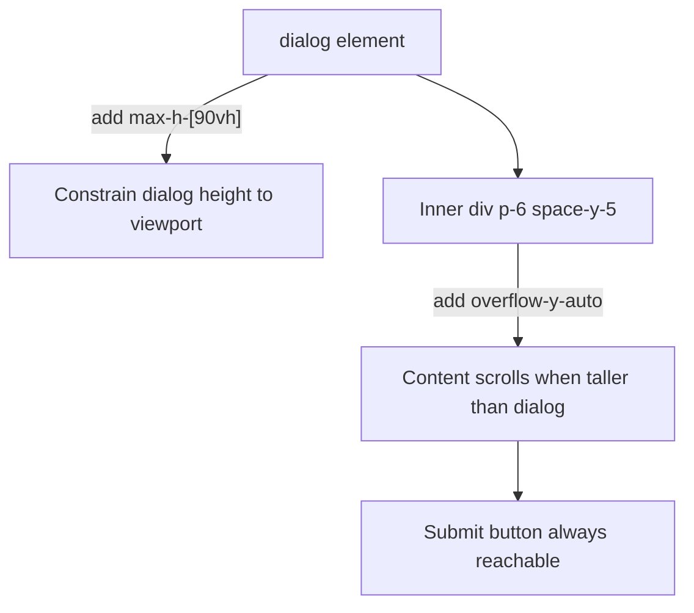

## Overview

Add `max-h-[90vh]` and `overflow-y-auto` to the Connect eToro modal dialog so it scrolls on short viewports instead of clipping the submit button.

## Research notes

- The `<dialog>` element uses native `showModal()` which centers in the viewport via the `::backdrop` pseudo-element
- Adding `max-h` and `overflow-y-auto` to a `<dialog>` works correctly in all modern browsers
- Tailwind's `max-h-[90vh]` compiles to `max-height: 90vh` — no runtime overhead
- The inner `div` with `p-6 space-y-5` is the scroll container; adding `overflow-y-auto` there keeps the dialog's rounded corners and border intact

## Architecture diagram

## One-week decision

**YES** — This is a two-class CSS change in one file. Implementation takes minutes.

## Implementation plan

1. Open `src/components/ConnectEtoroModal.tsx`
2. Add `max-h-[90vh]` to the `<dialog>` element's className
3. Add `overflow-y-auto` to the inner `
` element
4. Run tests to verify nothing breaks
5. Verify in browser

## Problem statement

The Connect eToro modal (`ConnectEtoroModal.tsx`) overflows the viewport on screens shorter than ~650px. The dialog element has no `max-height` or `overflow-y-auto`, so when its content (595px+) exceeds the available viewport height, the "Connect with API keys" submit button and the security disclaimer text below it are clipped and inaccessible. Users on laptops with visible dock/taskbar, tablets, or any short viewport cannot see or click the submit button.

## User story

As a user trying to connect my eToro account, I want the Connect modal to be fully scrollable so that I can always reach the submit button regardless of my browser window height.

## How it was found

During browser review on a 1280x633 viewport, the Connect modal's submit button was barely visible at the bottom edge, and the security disclaimer below it was completely hidden. The dialog element's `scrollHeight` (595px+) exceeded its `clientHeight`, confirming content overflow with no scroll mechanism.

Evidence: screenshots 424, 429, 430, 435 all show the button clipped at the bottom edge.

## Proposed UX

- The dialog should have `max-h-[90vh]` so it never exceeds 90% of the viewport height
- The inner content container should have `overflow-y-auto` so users can scroll within the modal
- On tall viewports where the modal fits, behavior is unchanged (no scrollbar visible)
- On short viewports, the modal is scrollable and all content including the submit button and disclaimer is reachable

## Acceptance criteria

- [ ] Dialog element has `max-h-[90vh]` class
- [ ] Inner content div has `overflow-y-auto` class
- [ ] On a 633px viewport, the "Connect with API keys" button and security disclaimer below it are fully visible (scroll if needed)
- [ ] On tall viewports (900px+), the modal looks identical to current behavior
- [ ] Existing tests pass
- [ ] Verified in browser with agent-browser screenshot

## Verification

- Run `npx vitest run` — all tests pass
- Open the modal in agent-browser and confirm the submit button is accessible
- Screenshot evidence of the fix

## Out of scope

- Redesigning the modal layout or content
- Adding animation to scroll
- Changing modal width or positioning
