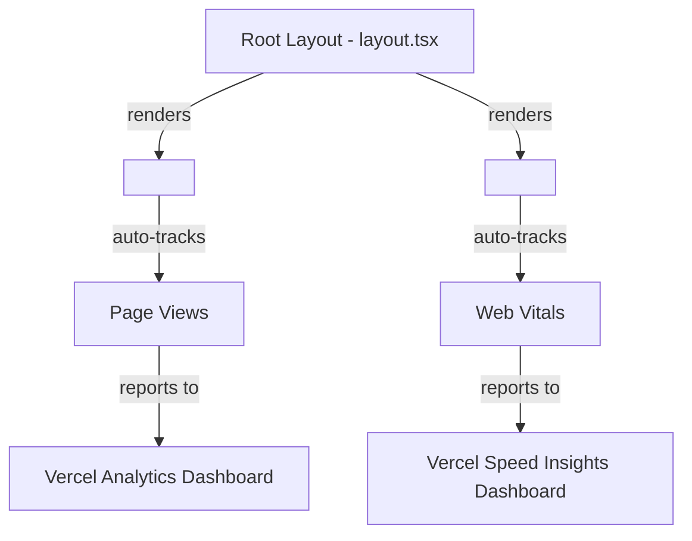

## Problem Statement

The initiative spec requires "Add basic error tracking (Sentry or Vercel Analytics)" under "Error Tracking & Monitoring." Currently, the app has structured server-side logging via `src/lib/logger.ts` and an error-reporter stub that logs to console, but no actual analytics or performance monitoring package is installed. In production on Vercel, there is zero visibility into page views, Web Vitals, or real-user performance metrics.

Task 0005 (Error Tracking & Monitoring) was executed but only implemented the structured logger and health endpoint — no Sentry SDK or Vercel Analytics was actually added.

## User Story

As a product owner deploying Trade the Past to production, I want real-time page view analytics and Web Vitals performance data, so that I can monitor user engagement and catch performance regressions before users complain.

## How It Was Found

Surface sweep review: inspected `package.json` (no `@vercel/analytics` or `@vercel/speed-insights` or `@sentry/nextjs` listed), verified `src/lib/error-reporter.ts` only has a Sentry stub that's never wired up, and confirmed the initiative spec explicitly lists "Add basic error tracking (Sentry or Vercel Analytics)" as a requirement.

## Proposed UX

No visible UI change. The analytics and speed insights components are invisible — they run in the background and report data to the Vercel dashboard.

## Research Notes

- `@vercel/analytics` provides automatic page view tracking and custom events. Works on Vercel with zero config, falls back to no-op in development.
- `@vercel/speed-insights` provides real-user Web Vitals monitoring (LCP, FID, CLS, TTFB, INP). Also zero-config on Vercel.
- Both packages are <1KB gzipped and do not affect Lighthouse scores.
- Import paths: `@vercel/analytics/next` and `@vercel/speed-insights/next` for Next.js-specific wrappers.
- Both export React components that should be placed in the root layout body.
- No environment variables needed — they auto-detect the Vercel deployment environment.

## Architecture Diagram

## One-Week Decision

**YES** — This is a ~30 minute task: install 2 packages, add 2 component imports to root layout. No tests to write (the packages are tested by Vercel), no config needed.

## Implementation Plan

### Phase 1: Install packages
- `npm install @vercel/analytics @vercel/speed-insights`

### Phase 2: Add to root layout
- Import `Analytics` from `@vercel/analytics/next`
- Import `SpeedInsights` from `@vercel/speed-insights/next`
- Add `<Analytics />` and `<SpeedInsights />` inside the `<body>` in `src/app/layout.tsx`

### Phase 3: Verify
- `npm run build` passes
- `npm test` passes
- `npx tsc --noEmit` passes

## Acceptance Criteria

- [ ] `@vercel/analytics` package installed and `<Analytics />` component rendered in the root layout
- [ ] `@vercel/speed-insights` package installed and `<SpeedInsights />` component rendered in the root layout
- [ ] Both components only render in production (or optionally in development with debug mode)
- [ ] No impact on Lighthouse score or bundle size regression (both packages are <1KB)
- [ ] Existing tests still pass
- [ ] TypeScript compiles without errors

## Verification

- Run `npm run build` — no errors
- Run `npm test` — all tests pass
- Verify `<Analytics />` and `<SpeedInsights />` appear in the root layout markup

## Out of Scope

- Sentry integration (requires external SENTRY_DSN configuration)
- Custom event tracking beyond default page views
- Analytics dashboard configuration
