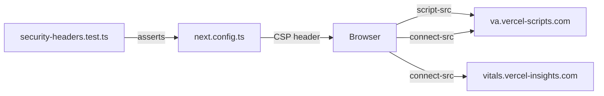

## Problem statement

The Content-Security-Policy header in `next.config.ts` has `script-src 'self' 'unsafe-inline'` and `connect-src 'self'`, which do not include Vercel's analytics domains. Vercel Analytics (`@vercel/analytics`) and Speed Insights (`@vercel/speed-insights`) were added in a recent task, but the CSP was not updated to allow their required domains:

- Scripts load from `https://va.vercel-scripts.com`
- Data is sent to `https://va.vercel-scripts.com` and `https://vitals.vercel-insights.com`

In production, the browser will block these scripts and network requests, making the monitoring infrastructure silently non-functional.

## User story

As a product operator, I want Vercel Analytics and Speed Insights to actually work in production so that I can monitor real user performance and usage patterns.

## How it was found

During a surface-sweep review, external resource loads were inspected via `performance.getEntriesByType("resource")` and compared against the CSP directives. The CSP `script-src` does not include `https://va.vercel-scripts.com` and `connect-src` does not include the analytics reporting domains. In dev mode scripts load because CSP enforcement varies, but in production these will be blocked.

## Proposed fix

Update the CSP in `next.config.ts`:
- Add `https://va.vercel-scripts.com` to `script-src`
- Add `https://va.vercel-scripts.com https://vitals.vercel-insights.com` to `connect-src`

Update the security headers test to verify the Vercel Analytics domains are present.

## Acceptance criteria

- [ ] `script-src` includes `https://va.vercel-scripts.com`
- [ ] `connect-src` includes `https://va.vercel-scripts.com` and `https://vitals.vercel-insights.com`
- [ ] Security headers test updated and passes
- [ ] Full test suite passes
- [ ] Build succeeds

## Verification

- Run `npm test` — all tests pass
- Run `npm run build` — build succeeds
- Check response headers with `curl -sI http://localhost:3050/` and verify updated CSP

## Out of scope

- Changing any other CSP directives
- Adding nonce-based script loading
- Vercel Analytics configuration changes

## Planning

### Overview

Two-file fix: update the CSP directives in `next.config.ts` and update the corresponding test in `src/lib/__tests__/security-headers.test.ts` to assert the new domains are present.

### Research notes

- Vercel Analytics scripts load from `https://va.vercel-scripts.com/v1/script.debug.js` (dev) and `https://va.vercel-scripts.com/v1/script.js` (prod)
- Vercel Speed Insights loads from `https://va.vercel-scripts.com/v1/speed-insights/script.debug.js` (dev) and prod equivalent
- Both send beacon/fetch data back to `https://va.vercel-scripts.com` and `https://vitals.vercel-insights.com`
- The wildcard `https://va.vercel-scripts.com` covers both script loading and data reporting for that origin

### Architecture diagram

### One-week decision

**YES** — This is a two-line config change plus a test update. Under 30 minutes of work.

### Implementation plan

1. Update `next.config.ts`: add `https://va.vercel-scripts.com` to `script-src`, add `https://va.vercel-scripts.com https://vitals.vercel-insights.com` to `connect-src`
2. Update `src/lib/__tests__/security-headers.test.ts`: update the `connect-src` assertion to include the Vercel domains, add assertion for `script-src` including Vercel domain
3. Run tests, verify build
