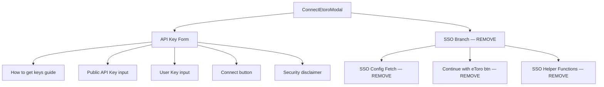

## Problem statement

The "Connect to eToro" modal always shows the message: "SSO is not configured on this deployment. Connect using your eToro API keys below, or ask the administrator to add eToro OAuth credentials." This message is visible to **every user** who clicks the Connect eToro button, since SSO is explicitly out of scope for this initiative. The message references internal technical concepts (SSO, deployment, administrator, OAuth) that regular traders would not understand. It makes the product feel like developer tooling rather than a polished trading tool.

## User story

As a trader visiting the app, I want to connect my eToro account without seeing confusing technical messages about SSO or deployments, so that the connection flow feels professional and trustworthy.

## How it was found

During a browser review of the live app at http://localhost:3050, clicking the "Connect eToro" header button opens the Connect modal. The SSO fallback notice is always displayed because SSO is not configured (by design — it's out of scope). Screenshot evidence: review-screenshots/474-connect-modal.png and review-screenshots/485-trade-click-not-connected.png.

## Proposed UX

- Remove the SSO fallback notice paragraph entirely from `ConnectEtoroModal.tsx`.
- The modal should open directly to the API key form: the "How to get your API keys" guide, the Public API Key and User Key inputs, and the "Connect with API keys" submit button.
- Since SSO is out of scope, also remove the SSO "Continue with eToro" button and related conditional logic (the `ssoReady` branch). The modal should only show the API key flow.
- Keep the modal header ("Connect to eToro") and subtitle ("Trade directly from event analysis and manage your eToro watchlist.").

## Acceptance criteria

- [ ] The Connect modal does NOT show any message containing "SSO", "deployment", "administrator", or "OAuth credentials"
- [ ] The modal opens directly to the API key connection form (guide + inputs + submit button)
- [ ] The SSO "Continue with eToro" button code path is removed (dead code cleanup)
- [ ] All existing tests pass
- [ ] Verify in browser: clicking "Connect eToro" shows a clean API key form with no technical notices

## Verification

- Run `npm test` — all tests pass
- Open http://localhost:3050 in agent-browser, click "Connect eToro", verify the modal shows only the API key form without any SSO-related messages. Take a screenshot as evidence.

## Out of scope

- Adding SSO support (deferred per initiative spec)
- Changing the auth/callback page error messages (SSO-only flow, users won't reach it)
- Changing the API key form layout or validation logic
- Removing SSO API routes (`/api/auth/sso`, `/api/auth/sso-config`) or the `/auth/callback` page — these stay for future SSO work

---

## Planning

### Overview

The ConnectEtoroModal component has two code paths: SSO (when configured) and API keys (fallback). Since SSO is out of scope for this initiative, the SSO code path is dead code and the fallback notice is always displayed. This task removes the SSO UI code from the modal so it opens cleanly to the API key form.

### Research notes

- `ConnectEtoroModal.tsx` (300 lines): Contains SSO helper functions (base64UrlEncode, randomVerifier, sha256Challenge), SSO config fetch, SSO state variables, and conditional rendering.
- `ConnectEtoroModal.test.tsx`: Mocks `/api/auth/sso-config` fetch returning `{ configured: false }`. Tests use `waitFor(fetch)` to wait for render completion.
- SSO API routes (`/api/auth/sso`, `/api/auth/sso-config`) and `/auth/callback` page exist but are NOT used in the current flow. They should stay for future SSO implementation.
- The `AuthProvider.tsx` has SSO-related exports (`ssoAvailable`, `loginWithSSO`) used in the mock but not by the modal directly.

### Assumptions

- SSO API routes and the auth/callback page are preserved as-is for future work.
- The `AuthProvider` interface stays unchanged (other components may reference SSO fields).

### Architecture diagram

### One-week decision

**YES** — This is a focused code removal task touching 2 files. ~30 minutes of work.

### Implementation plan

**Phase 1: Clean up ConnectEtoroModal.tsx**
1. Remove SSO helper functions: `base64UrlEncode`, `randomVerifier`, `sha256Challenge`
2. Remove `DEFAULT_AUTHORIZE_BASE` constant and `SSOConfigResponse` interface
3. Remove SSO state variables: `ssoConfig`, `ssoStarting`, `showApiKeys`
4. Remove SSO config fetch effect (lines 70-85)
5. Remove `startSSO` function
6. Remove the SSO conditional rendering: the `ssoReady` check, the "Continue with eToro" button, the "Use API keys instead" toggle, and the SSO fallback notice paragraph
7. Always render the API key form directly (remove the `showApiKeys || !ssoReady` condition)
8. Remove the SSO-only disclaimer at the bottom (lines 291-295)
9. Clean up `handleClose` to not reset SSO state

**Phase 2: Update tests**
1. Remove the SSO config fetch mock from `ConnectEtoroModal.test.tsx`
2. Update `waitFor` conditions — they currently wait for `fetch` to be called, which won't happen after removing the SSO config fetch. Use DOM-based waits instead.
3. Verify all 6 existing tests still pass with appropriate assertions.

**Phase 3: Verify**
1. Run `npm test` — all 305 tests pass
2. Open app in browser, click "Connect eToro", verify clean modal
